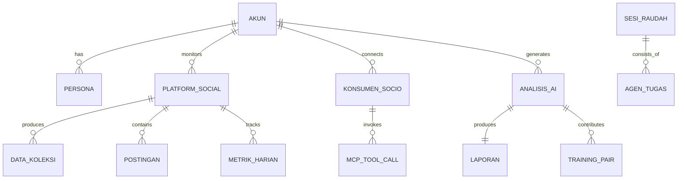

# BRIEF: SIDIX-SocioMeter untuk Cursor
## Instruksi Kerja — Buat, Commit, Push, Catat

**Status:** SIAP EKSEKUSI  
**Branch Target:** `sociometer-sprint7`  
**Repo:** `https://github.com/fahmiwol/sidix.git`

---

## STEP 0: SETUP (Jalankan di Terminal Cursor)

```bash
# Clone repo
git clone https://github.com/fahmiwol/sidix.git ~/sidix

# Buat branch baru
cd ~/sidix
git checkout -b sociometer-sprint7

# Buat folder struktur
mkdir -p docs/sociometer/{strategi,prd,erd,dokumentasi,fitur,plan,riset,script}
```

---

## STEP 1: BUAT 8 FILE DOKUMEN

Buat file di bawah ini satu per satu. Isi ada di section **"ISI FILE"** di bawah.

| No | File Path | Status |
|----|-----------|--------|
| 1 | `docs/sociometer/strategi/01_STRATEGI_SOCIOMETER.md` | ⬜ |
| 2 | `docs/sociometer/prd/02_PRD_SOCIOMETER.md` | ⬜ |
| 3 | `docs/sociometer/erd/03_ERD_SOCIOMETER.md` | ⬜ |
| 4 | `docs/sociometer/dokumentasi/04_DOKUMENTASI_SOCIOMETER.md` | ⬜ |
| 5 | `docs/sociometer/fitur/05_FITUR_SPECS_SOCIOMETER.md` | ⬜ |
| 6 | `docs/sociometer/plan/06_IMPLEMENTATION_SOCIOMETER.md` | ⬜ |
| 7 | `docs/sociometer/riset/07_RISET_SOCIOMETER.md` | ⬜ |
| 8 | `docs/sociometer/script/08_SCRIPT_MODULE_SOCIOMETER.md` | ⬜ |

---

## STEP 2: COMMIT & PUSH

```bash
cd ~/sidix
git add -A
git commit -m "docs: SIDIX-SocioMeter documentation suite v1.0

- Strategi: Arsitektur ekosistem dan Jariyah harvesting loop
- PRD: 19 fitur (6 P0 + 13 roadmap)
- ERD: 18 tabel database, 6 domain
- Dokumentasi: Arsitektur 6 lapis
- Fitur Specs: API specification lengkap
- Implementation: 12 sprint (24 minggu)
- Riset: Technology & market analysis
- Script: Module reference producation-ready

Terminologi SIDIX-native: Maqashid, Naskh, Raudah, Sanad, Muhasabah, Jariyah, Tafsir

Closes: Sprint 7 foundation"

git push origin sociometer-sprint7
```

---

## STEP 3: CATATAN PROGRES

Isi file `docs/sociometer/CATATAN_PROGRES.md` dengan format:

```markdown
# CATATAN PROGRES: SIDIX-SocioMeter

## Sprint 7 — Foundation

| Tanggal | Yang Dikerjakan | Status | Oleh |
|---------|----------------|--------|------|
| YYYY-MM-DD | Clone repo + buat branch | ✅ Done | Cursor |
| YYYY-MM-DD | File 1-8: Dokumentasi suite | ✅ Done | Cursor |
| YYYY-MM-DD | Push ke sociometer-sprint7 | ✅ Done | Cursor |
| YYYY-MM-DD | Review + merge PR | ⬜ Pending | Founding Circle |

## Blocker
- Tidak ada

## Next
- Sprint 8: Chrome Extension MVP
```

---

## ISI FILE (Copy-Paste Satu per Satu)

---

### FILE 1: strategi/01_STRATEGI_SOCIOMETER.md

```markdown
# STRATEGI SOCIO-METER
## Sistem Ekspansi SIDIX ke Ekosistem AI Global

**Versi:** 1.0 | **Status:** FINAL | **Klasifikasi:** Dokumen Strategis

---

## 1. VISI

Socio-Meter adalah arsitektur ekspansi SIDIX yang memungkinkan SIDIX menjadi **tool/plugin** yang dapat dipasang di AI agents dan platform lain (ChatGPT, Claude, Cursor, Kimi, DeepSeek, Gemini, dll) — tanpa kehilangan identitas sebagai sistem **self-hosted** yang **standing alone**.

> *"SIDIX tidak pergi ke platform lain. SIDIX membuka pintu, dan platform lain yang datang ke SIDIX."*

---

## 2. ARSITEKTUR 6 LAPISAN

| Lapis | Nama | Fungsi |
|-------|------|--------|
| 1 | **Connectors** | Adapter per platform: `sociometer-gpt`, `sociometer-claude`, `sociometer-cursor`, `sociometer-kimi`, `sociometer-deepseek`, `sociometer-gemini`, `sociometer-windsurf`, `sociometer-vscode`, `sociometer-antygravity` |
| 2 | **MCP Server** | FastMCP: 6 tools + resources + prompts |
| 3 | **Gatekeeper** | Maqashid Filter + Naskh Handler |
| 4 | **SIDIX Core** | Qwen2.5-7B + LoRA, Raudah Protocol, 35+ Tools, 5 Persona |
| 5 | **Jariyah Harvesting** | Collector → Sanad Pipeline → Mizan Repository → Tafsir Engine |
| 6 | **Presentation** | Next.js Dashboard (port 3000), Chrome Extension, CLI |

---

## 3. SELF-TRAINING: Sistem Jutaan Agen (Jariyah)

**Jariyah** = sistem self-training terdistribusi. Setiap interaksi = sedekah ilmu yang terus mengalir.

**Pipeline:**
```
Socio-Meter Nodes (Chrome Ext / MCP / API / Widget)
    ↓
Collector — Gathering interaction logs + context + quality signals
    ↓
Sanad Pipeline — MinHash dedup (≥0.85) → CQF scoring (≥7.0) → Sanad validation → Naskh resolution → Maqashid filter
    ↓
Mizan Repository — PostgreSQL + MinIO + Corpus + Knowledge Graph
    ↓
Tafsir Engine — QLoRA retrain (r=16, alpha=32, 3 epochs), A/B test, auto-deploy/rollback
```

---

## 4. ROADMAP GENERATIVE — 7 FASE

| Fase | Versi | Kemampuan Baru |
|------|-------|---------------|
| **Fase 0** | v0.6.1 (sekarang) | Text, Image (SDXL), Voice, RAG, ReAct |
| **Fase 1** | v0.7.0 | +Vision (Qwen2.5-VL), Video analysis, Audio gen |
| **Fase 2** | v0.8.0 | +FLUX image, Style transfer, Layout auto-gen |
| **Fase 3** | v0.9.0 | +Text-to-video (CogVideo), Reel/TikTok creator |
| **Fase 4** | v1.0.0 | +Text-to-3D (Hunyuan3D), AR preview |
| **Fase 5** | v1.1.0 | +Full-stack code, Website builder, App prototype |
| **Fase 6** | v1.2.0 | +Campaign auto, Content factory, Brand guardian |
| **Fase 7** | v2.0.0 | +Autonomous creative, Cross-modal, Meta-learning |

---

## 5. GROWTH STRATEGY

| Fase | Target | Strategi |
|------|--------|----------|
| Penanaman | 10 users | Founding Circle — personal invite |
| Perkecambahan | 50 users | Case study reels, TikTok tutorials, referral |
| Pertumbuhan | 500 users | Product Hunt, SEO, podcast, webinar |
| Pembesaran | 5,000 users | Chrome Web Store featured, HF Space |
| Maturity | 50,000 users | White-label, enterprise API |

---

## 6. MONETISASI (3 Tier)

| Tier | Nama | Harga | Fitur |
|------|------|-------|-------|
| Free | **Sadaqah** | $0 | 1 competitor, IG only, basic |
| Pro | **Infaq** | $9/bulan | 10 competitors, multi-platform, PDF |
| Enterprise | **Wakaf** | $99/bulan | Unlimited, real-time, API, white-label |

---

## 7. IMPLEMENTATION — 12 SPRINT (24 Minggu)

| Sprint | Fokus | ETA |
|--------|-------|-----|
| 7 (sekarang) | MCP Server + Wire Maqashid/Naskh | Week 1-2 |
| 8 | Chrome Extension MVP | Week 3-4 |
| 9 | Jariyah Harvesting Loop | Week 5-6 |
| 10 | Dashboard Semrawut + Privacy | Week 7-8 |
| 11 | Distribution (MCP Hubs, CWS) | Week 9-10 |
| 12-17 | Generative Fase 1-6 | Week 11-22 |
| 18 | v1.0 Launch | Week 23-24 |

---

## 8. KESIMPULAN

Prinsip yang tidak berubah:
- **Standing alone** — model sendiri, corpus sendiri, infra sendiri
- **Transparansi epistemologis** — sanad chain, 4-label, maqashid scoring
- **Kedaulatan data** — data user tetap milik user, anonim untuk training
- **Jariyah ilmu** — setiap interaksi = sedekah ilmu yang terus mengalir

SIDIX bukan produk — SIDIX adalah **amanah**.
```

---

### FILE 2: prd/02_PRD_SOCIOMETER.md

```markdown
# PRD: SIDIX-SocioMeter
## Product Requirements Document

**Versi:** 1.0 | **Status:** FINAL | **Klasifikasi:** Product Requirements

---

## 1. RINGKASAN PRODUK

SIDIX-SocioMeter = sistem ekspansi terdistribusi SIDIX:
1. **MCP plugin** untuk AI platforms (ChatGPT, Claude, Cursor, dll)
2. **Chrome Extension** (`sociometer-browser`) untuk universal data collection
3. **Jariyah self-training** — setiap interaksi = training pair
4. **Roadmap generatif 7 fase** — dari creative hingga autonomous AI

---

## 2. FITUR P0 (MVP)

### F-001: MCP Server
- 6 core tools: `nasihah_creative`, `nasihah_analyze`, `nasihah_design`, `nasihah_code`, `nasihah_raudah`, `nasihah_learn`
- Transport: stdio + streamable-http + SSE
- Auto-discovery, Maqashid auto-tag, Sanad metadata
- Persona routing: AYMAN/ABOO/OOMAR/ALEY/UTZ

### F-002: Chrome Extension (Manifest V3)
- Network interception: Instagram, TikTok, YouTube, LinkedIn, Facebook
- Sidebar panel: persona selector + quick actions + chat
- Auto-suggest saat mengetik (Gmail, WhatsApp Web, Twitter)
- Offline buffer (IndexedDB), privacy dashboard

### F-003: Jariyah Harvesting Loop
- Auto-capture: MCP + dashboard + browser + manual
- MinHash deduplication (similarity ≥ 0.85)
- CQF scoring (10 kriteria, threshold ≥ 7.0)
- Sanad validation + Naskh resolution + Maqashid filter
- QLoRA retrain trigger: 5,000 pairs OR quarterly

### F-004: Raudah Multi-Agent v0.2
- TaskGraph DAG dengan dependency tracking
- Parallel specialists dengan auto-select
- Progress tracking via SSE
- Retry: max 3, Timeout: 120s per agent

### F-005: Maqashid Filter v2.1 (Wired)
- Wire ke `run_react()` sebagai middleware
- 4 mode: CREATIVE, ACADEMIC, IJTIHAD, GENERAL
- Auto-select mode dari task + persona
- Block harmful: 0% false negative

### F-006: Naskh Handler v1.1 (Wired)
- Wire ke `learn_agent.py` corpus pipeline
- Sanad-tier: primer > ulama > peer-reviewed > aggregator
- `is_frozen` flag, auto-merge, conflict flag

---

## 3. FITUR ROADMAP (P1-P3)

| Kode | Fitur | Fase | Priority |
|------|-------|------|----------|
| G-001 | Vision understanding (Qwen2.5-VL) | Fase 1 | P2 |
| G-002 | FLUX image generation | Fase 2 | P2 |
| G-003 | Brand visual style transfer | Fase 2 | P2 |
| G-004 | Layout auto-generation | Fase 2 | P2 |
| G-005 | Infographic generation | Fase 2 | P2 |
| G-006 | Text-to-video (CogVideo) | Fase 3 | P3 |
| G-007 | Image-to-video animation | Fase 3 | P3 |
| G-008 | Reel/TikTok auto-generator | Fase 3 | P3 |
| G-009 | Video editing AI | Fase 3 | P3 |
| G-010 | Text-to-3D (Hunyuan3D) | Fase 4 | P3 |
| G-011 | Image-to-3D conversion | Fase 4 | P3 |
| G-012 | AR preview generation | Fase 4 | P3 |
| G-013 | Full-stack code generation | Fase 5 | P3 |
| G-014 | Website builder | Fase 5 | P3 |
| G-015 | App prototype generator | Fase 5 | P3 |
| G-016 | Campaign automation | Fase 6 | P3 |
| G-017 | Content factory | Fase 6 | P3 |
| G-018 | Brand guardian AI | Fase 6 | P3 |
| G-019 | Monetization optimizer | Fase 6 | P3 |

---

## 4. 5 PERSONA

| Nama | Karakter | Maqashid Mode | Kekuatan |
|------|----------|---------------|----------|
| **AYMAN** | Strategic Sage | IJTIHAD | Research, vision, strategy, long-form |
| **ABOO** | The Analyst | ACADEMIC | Data, logic, structured argument, code |
| **OOMAR** | The Craftsman | IJTIHAD | Technical deep-dives, system design, build |
| **ALEY** | The Learner | GENERAL | Teaching, curriculum, beginner-friendly |
| **UTZ** | The Generalist | CREATIVE | Daily tasks, flexible, creative output |

---

## 5. CQF — CONTENT QUALITY FRAMEWORK

| # | Kriteria | Bobot | Cara Ukur |
|---|----------|-------|-----------|
| 1 | Kejelasan (Clarity) | 10% | Flesch Reading Ease ≥ 60 |
| 2 | Kelengkapan (Completeness) | 10% | Coverage checklist |
| 3 | Akurasi (Accuracy) | 15% | Factual vs corpus |
| 4 | Relevansi (Relevance) | 15% | Cosine similarity |
| 5 | Kreativitas (Creativity) | 10% | Uniqueness score |
| 6 | Sanad (Attribution) | 15% | Source chain present |
| 7 | Maqashid (Alignment) | 10% | Mode-based score |
| 8 | Tindak lanjut (Actionability) | 5% | Action items count |
| 9 | Konsistensi (Consistency) | 5% | Style coherence |
| 10 | Keamanan (Safety) | 5% | Harm detection |

**Threshold:** Minimum 7.0/10 untuk masuk corpus.

---

## 6. ACCEPTANCE CRITERIA

- [ ] 50 creative queries PASS Maqashid
- [ ] 20 harmful queries BLOCK (0% false negative)
- [ ] Unit test coverage ≥ 80%
- [ ] MCP tool discovery < 500ms
- [ ] Response time: text < 3s, image < 10s
- [ ] All 6 P0 features functional
```

---

### FILE 3: erd/03_ERD_SOCIOMETER.md

```markdown
# ERD: SIDIX-SocioMeter
## Entity Relationship Diagram

**Versi:** 1.0 | **Status:** FINAL | **Klasifikasi:** Technical Specification

---

## 1. OVERVIEW

18 tabel, 6 domain:
1. Akun & Identitas
2. Koleksi Data
3. Analitik
4. Korpus
5. Tugas (Raudah)
6. Socio-Meter

---

## 2. ENTITY RELATIONSHIPS (Mermaid)



---

## 3. TABLE DEFINITIONS

### Domain: Akun & Identitas

**akun**
```
id UUID PK
username VARCHAR(100) UNIQUE
email VARCHAR(255) UNIQUE
password_hash VARCHAR(255)
tier VARCHAR(20) [sadaqah|infaq|wakaf]
status VARCHAR(20) [aktif|suspend|nonaktif]
created_at TIMESTAMP
```

**persona**
```
id UUID PK
akun_id UUID FK → akun.id
nama VARCHAR(20) [AYMAN|ABOO|OOMAR|ALEY|UTZ]
preferensi JSONB
creative_weight FLOAT [0-1]
analytical_weight FLOAT [0-1]
technical_weight FLOAT [0-1]
UNIQUE(akun_id, nama)
```

**platform_social**
```
id UUID PK
akun_id UUID FK → akun.id
platform_nama VARCHAR(50) [instagram|tiktok|youtube|linkedin|facebook|twitter]
username VARCHAR(100)
username_hash VARCHAR(64) — HMAC-SHA256
follower_count INTEGER
following_count INTEGER
post_count INTEGER
is_verified BOOLEAN
is_business BOOLEAN
profile_raw JSONB — encrypted
profile_anonymized JSONB — privacy-safe
status VARCHAR(20) [aktif|error|nonaktif]
last_scraped_at TIMESTAMP
```

**konsumen_sociometer**
```
id UUID PK
akun_id UUID FK → akun.id
platform_nama VARCHAR(50) [claude|chatgpt|cursor|windsurf|kimi|deepseek|gemini|vscode]
config_json JSONB
transport VARCHAR(20) [stdio|http|sse]
status VARCHAR(20) [aktif|nonaktif|error]
```

### Domain: Koleksi Data

**data_koleksi**
```
id UUID PK
platform_id UUID FK → platform_social.id
akun_id UUID FK → akun.id
tipe_data VARCHAR(20) [profile|post|story|reel|comment|video]
platform_sumber VARCHAR(50)
data_mentah JSONB — encrypted
data_anonim JSONB — privacy-safe
quality_score FLOAT
collection_method VARCHAR(50)
consent_level VARCHAR(20) [none|basic|full|research]
scraped_at TIMESTAMP
```

**postingan**
```
id UUID PK
platform_id UUID FK → platform_social.id
content_id VARCHAR(255)
caption TEXT
caption_hash VARCHAR(64) — HMAC
format VARCHAR(20) [reel|carousel|video|image|story|text]
likes / comments / shares / saves / views INTEGER
engagement_rate FLOAT
hashtags / mentions JSONB
posted_at TIMESTAMP
UNIQUE(platform_id, content_id)
```

**media**
```
id UUID PK
postingan_id UUID FK → postingan.id
url TEXT, mime_type VARCHAR(100)
file_size INTEGER, checksum VARCHAR(64)
storage_path TEXT, status [pending|stored|error]
```

### Domain: Analitik

**metrik_harian**
```
id UUID PK
platform_id UUID FK → platform_social.id
tanggal DATE
followers / follower_growth / following INTEGER
posts_published INTEGER
total_likes / comments / shares / saves / views INTEGER
engagement_rate FLOAT
engagement_rate_vs_niche FLOAT
UNIQUE(platform_id, tanggal)
```

**analisis_ai**
```
id UUID PK
akun_id UUID FK → akun.id
platform_id UUID FK → platform_social.id
tipe_analisis VARCHAR(50) [competitor|trend|content|growth|audit]
prompt_used TEXT
ai_response_raw / ai_response_filtered TEXT
structured_output JSONB
cqf_score FLOAT
maqashid_score_creative / academic / ijtihad FLOAT
maqashid_mode_used VARCHAR(20)
maqashid_passed BOOLEAN
persona_used VARCHAR(20)
token_used / inference_time_ms INTEGER
generated_at TIMESTAMP
```

**laporan**
```
id UUID PK
analisis_id UUID FK → analisis_ai.id
akun_id UUID FK → akun.id
tipe_laporan VARCHAR(50) [weekly|monthly|competitor|trend|full]
judul VARCHAR(255), konten TEXT
metadata JSONB, format [markdown|pdf|html|json]
quality_score FLOAT, created_at TIMESTAMP
```

### Domain: Korpus

**training_pair**
```
id UUID PK
analisis_id UUID FK → analisis_ai.id
instruction TEXT, response TEXT
format VARCHAR(20) [alpaca|sharegpt|chatml]
cqf_score FLOAT, uniqueness_score FLOAT
is_duplicate BOOLEAN, used_for_training BOOLEAN
times_referenced INTEGER, source VARCHAR(50)
sanad_chain TEXT, metadata JSONB
created_at / trained_at TIMESTAMP
```

**korpus_versi**
```
id UUID PK
versi VARCHAR(20) UNIQUE
total_pairs INTEGER, avg_cqf_score FLOAT
dedup_removed / maqashid_blocked INTEGER
model_used VARCHAR(50), lora_config_json JSONB
training_loss / validation_loss / accuracy_benchmark FLOAT
win_rate_vs_previous FLOAT
status VARCHAR(20) [training|evaluating|deployed|rolled_back]
trained_at TIMESTAMP
```

**pengetahuan_entitas** (Knowledge Graph)
```
id UUID PK
entitas_nama VARCHAR(255), entitas_tipe [person|brand|concept|product|trend]
atribut / relasi JSONB
confidence FLOAT [0-1], reference_count INTEGER
created_at / updated_at TIMESTAMP
```

### Domain: Tugas (Raudah)

**sesi_raudah**
```
id UUID PK
akun_id UUID FK → akun.id
task_description TEXT, persona_utama VARCHAR(20)
specialists_assigned JSONB
status [pending|running|completed|failed]
progress_percent FLOAT, dag_structure JSONB
started_at / completed_at TIMESTAMP
```

**agen_tugas**
```
id UUID PK
sesi_id UUID FK → sesi_raudah.id
nama_agen VARCHAR(100), persona VARCHAR(20)
prompt / response TEXT
status [pending|running|completed|failed|skipped]
execution_order INTEGER, depends_on UUID[]
retry_count INTEGER, started_at / completed_at TIMESTAMP
```

### Domain: Socio-Meter

**mcp_tool_call**
```
id UUID PK
konsumen_id UUID FK → konsumen_sociometer.id
tool_name VARCHAR(100), parameters JSONB
response TEXT, token_used / latency_ms INTEGER
status [success|error|timeout], called_at TIMESTAMP
```

**browser_event**
```
id UUID PK
akun_id UUID FK → akun.id
event_type [page_visit|api_intercept|click|generate]
url / domain TEXT, payload JSONB
platform_detected VARCHAR(50)
privacy_level [none|basic|full|research]
event_at TIMESTAMP
```

---

## 4. INDEXES

```sql
-- Performance indexes
CREATE INDEX idx_platform_social_akun ON platform_social(akun_id);
CREATE INDEX idx_data_koleksi_akun ON data_koleksi(akun_id);
CREATE INDEX idx_postingan_platform ON postingan(platform_id);
CREATE INDEX idx_metrik_harian_platform_date ON metrik_harian(platform_id, tanggal DESC);
CREATE INDEX idx_analisis_ai_akun ON analisis_ai(akun_id);
CREATE INDEX idx_training_pair_score ON training_pair(cqf_score DESC) WHERE used_for_training = FALSE;
CREATE INDEX idx_training_pair_ready ON training_pair(cqf_score, created_at) WHERE used_for_training = FALSE AND is_duplicate = FALSE AND cqf_score >= 7.0;
CREATE INDEX idx_sesi_raudah_akun ON sesi_raudah(akun_id);
CREATE INDEX idx_mcp_call_konsumen ON mcp_tool_call(konsumen_id);
CREATE INDEX idx_browser_event_akun ON browser_event(akun_id);
```

---

## 5. ANONYMIZATION

```sql
-- View: platform_social_anonim
CREATE VIEW platform_social_anonim AS
SELECT id, akun_id, platform_nama, username_hash,
  CASE WHEN follower_count < 1000 THEN '0-1K'
       WHEN follower_count < 10000 THEN '1K-10K'
       WHEN follower_count < 100000 THEN '10K-100K'
       WHEN follower_count < 1000000 THEN '100K-1M' ELSE '1M+' END AS follower_bucket,
  CASE WHEN post_count < 50 THEN '0-50'
       WHEN post_count < 200 THEN '50-200'
       WHEN post_count < 500 THEN '200-500' ELSE '500+' END AS post_bucket,
  is_verified, is_business, status
FROM platform_social;
```
```

---

### FILE 4: dokumentasi/04_DOKUMENTASI_SOCIOMETER.md

```markdown
# DOKUMENTASI ARSITEKTUR: SIDIX-SocioMeter

**Versi:** 1.0 | **Status:** FINAL | **Klasifikasi:** Technical Documentation

---

## 1. 5 PRINSIP ARSITEKTURAL (Non-Negotiable)

| # | Prinsip | Implementasi |
|---|---------|--------------|
| 1 | **Standing Alone** | Model (Qwen+LoRA), corpus, infra — semua self-hosted. No vendor API. |
| 2 | **Transparansi Epistemologis** | Sanad chain, 4-label [FACT/REASONING/OPINION/UNCERTAIN], Maqashid scoring. |
| 3 | **Keadilan Data** | Local-first, opt-in granular, anonymization (hash+bucket), delete anytime. |
| 4 | **Evolusi Mandiri** | Jariyah loop: every interaction → CQF scoring → corpus → QLoRA retrain. |
| 5 | **Tawarruq** | Buka pintu ke platform lain via MCP tanpa kehilangan identitas. |

---

## 2. ARSITEKTUR 6 LAPISAN

### Lapisan 1: Connectors (`sociometer-*`)
Platform adapters: gpt, claude, cursor, windsurf, kimi, deepseek, gemini, vscode, antygravity.

### Lapisan 2: MCP Server (FastMCP)
- **Tools**: nasihah_creative, nasihah_analyze, nasihah_design, nasihah_code, nasihah_raudah, nasihah_learn
- **Resources**: `sidix://personas`, `sidix://tools`, `sidix://maqashid/modes`, `sidix://benchmarks/{niche}`
- **Prompts**: brand_audit, content_strategy, competitor_analysis, trend_detection
- **Transport**: stdio (Claude), streamable-http (production), SSE (real-time)

### Lapisan 3: Gatekeeper
```
Input → Validation (harmful?) → Maqashid Filter (mode select) → Naskh Check → Route ke Core
```

### Lapisan 4: SIDIX Core
- **Brain**: Qwen2.5-7B-Instruct + LoRA adapter (Ollama local)
- **Raudah**: TaskGraph DAG, multi-agent orchestration
- **Tools**: 35+ active (search, generate, code, image, dll)
- **Personas**: AYMAN, ABOO, OOMAR, ALEY, UTZ

### Lapisan 5: Harvesting (Jariyah)
```
Collector (Redis queue) → Sanad Pipeline → Mizan Repository → Tafsir Engine
```
**Sanad Pipeline** 5 steps:
1. MinHash deduplication (threshold 0.85)
2. CQF scoring (10 kriteria, threshold 7.0)
3. Sanad validation (source chain)
4. Naskh resolution (conflict: baru vs lama)
5. Maqashid filter (mode-based)

### Lapisan 6: Presentation
| Komponen | Teknologi | Port |
|----------|-----------|------|
| Dashboard | Next.js 15 + Tailwind + Recharts | 3000 |
| Chrome Ext | Vanilla JS, Manifest V3 | — |
| CLI | Python Click | — |

---

## 3. DATA FLOW — END TO END

```
[MCP Request dari Claude]
    → [sociometer-claude] translate ke SIDIX API
    → [MCP Server] tool routing
    → [Gatekeeper] Maqashid mode = IJTIHAD
    → [Persona Router] AYMAN selected (confidence 0.89)
    → [Raudah Protocol] 3 specialists (strategy + creative + market)
    → [Qwen2.5-7B] generate output
    → [Maqashid v2] CQF = 8.2/10 → PASS
    → [Sanad Tagging] 4-label applied
    → [Response] ke user via Connector
    → [Background: Harvesting] → Training Pair → Corpus
```

---

## 4. MODULE STRUCTURE

```
sidix/
├── brain/
│   ├── sociometer/
│   │   ├── mcp_server.py
│   │   ├── connectors/ (claude.py, gpt.py, cursor.py, ...)
│   │   ├── harvesting/ (collector.py, sanad_pipeline.py, mizan_repository.py, tafsir_engine.py)
│   │   └── browser/ (ingest_api.py, sync_handler.py)
│   ├── raudah/ (core.py, taskgraph.py, specialists.py)
│   └── naskh/ (handler.py, sanad_tier.py)
├── tools/ — 35+ Hands
├── apps/brain_qa/ — Inference (port 8765)
├── apps/SIDIX_USER_UI/ — Next.js (port 3000)
├── sociometer-browser/ — Chrome Extension
└── docs/ — Dokumentasi
    └── sociometer/ ← [KITA DISINI]
```

---

## 5. ENVIRONMENT VARIABLES

| Variable | Default | Keterangan |
|----------|---------|------------|
| SIDIX_MCP_TRANSPORT | streamable-http | stdio / streamable-http / sse |
| SIDIX_MCP_PORT | 8765 | Port MCP server |
| SIDIX_DB_HOST/PORT/NAME/USER/PASS | — | PostgreSQL credentials |
| SIDIX_REDIS_URL | redis://localhost:6379/0 | Queue + cache |
| SIDIX_MINIO_ENDPOINT/ACCESS_KEY/SECRET_KEY/BUCKET | — | Media storage |
| SIDIX_HARVEST_CQF_THRESHOLD | 7.0 | Minimum CQF score |
| SIDIX_LORA_RETRAIN_MIN_PAIRS | 5000 | Trigger retrain |
| SIDIX_ANON_SALT | — | HMAC salt untuk anonymization |
| SIDIX_DATA_RETENTION_DAYS | 365 | Retention policy |
```

---

### FILE 5: fitur/05_FITUR_SPECS_SOCIOMETER.md

```markdown
# FITUR SPECS: SIDIX-SocioMeter

**Versi:** 1.0 | **Status:** FINAL | **Klasifikasi:** Feature Specification

---

## P0 — MUST HAVE

### F-001: MCP Server
**Modul**: `brain/sociometer/mcp_server.py`
**Persona**: Router (semua)

6 tools via FastMCP:
- `nasihah_creative(brief, persona="AYMAN")` → copywriting, branding, marketing
- `nasihah_analyze(data, analysis_type="competitor")` → competitor, market, trends
- `nasihah_design(prompt, format="image")` → images, thumbnails, logos
- `nasihah_code(task, language="python")` → scripts, functions, apps
- `nasihah_raudah(task, specialists=None)` → multi-agent collaboration
- `nasihah_learn(topic, level="beginner")` → teaching mode

Resources: `sidix://personas`, `sidix://tools`, `sidix://maqashid/modes`, `sidix://benchmarks/{niche}`

Prompts: `prompt_brand_audit(brand, platform)`, `prompt_content_strategy(niche, platforms)`

---

### F-002: Chrome Extension (`sociometer-browser`)
**Manifest**: V3 | **Komponen**: background.js, content.js, injector.js, panel.html, popup.html

4 komponen utama:
1. **Content Script** — Network interceptor (fetch/XHR override)
2. **Service Worker** — Queue management, batch upload ke backend
3. **Sidebar Panel** — Persona selector, quick actions, chat
4. **Injection Engine** — Auto-suggest saat mengetik

Platform support: Instagram, TikTok, YouTube, LinkedIn, Facebook, Twitter/X + Gmail, WhatsApp Web, Google Docs

---

### F-003: Jariyah Harvesting Loop
**Modul**: `brain/sociometer/harvesting/`

Pipeline 4 komponen:
1. **collector.py** — Redis queue, async, 4 sumber (MCP, dashboard, browser, manual)
2. **sanad_pipeline.py** — MinHash dedup → CQF scoring → Sanad validate → Naskh resolve → Maqashid filter
3. **mizan_repository.py** — PostgreSQL + MinIO + Corpus + Knowledge Graph
4. **tafsir_engine.py** — Auto-retrain QLoRA, A/B test, deploy/rollback

---

### F-004: Raudah Multi-Agent v0.2
**Modul**: `brain/raudah/`

- TaskGraph DAG dengan topological sort
- Parallel execution per level
- SSE progress stream
- Retry: max 3, Timeout: 120s

---

### F-005: Maqashid Filter v2.1 (Wired)
**Modul**: `brain_qa/maqashid_profiles.py` → wire ke `run_react()`

4 mode:
| Mode | Gunakan Untuk | Persona |
|------|--------------|---------|
| CREATIVE | Iklan, konten, desain | UTZ |
| ACADEMIC | Riset, analisis, argumentasi | ABOO |
| IJTIHAD | Visi, inovasi, strategi | AYMAN, OOMAR |
| GENERAL | QA, penjelasan, ringkasan | ALEY |

---

### F-006: Naskh Handler v1.1 (Wired)
**Modul**: `brain_qa/naskh_handler.py` → wire ke `learn_agent.py`

Sanad-tier priority:
1. Sumber Primer (Quran, Hadits) — weight: 1.0
2. Ulama & Fuqaha — weight: 0.8
3. Peer-reviewed — weight: 0.6
4. Aggregator — weight: 0.4

Actions: accept, merge, conflict (flag for review), reject

---

## P1 — SHOULD HAVE

### F-007: Dashboard Semrawut
Dense analytics UI: AccountCards, EngagementGauge, ContentGrid, PostingHeatmap, TrendRadar, AIInsightPanel

### F-008: OpHarvest Privacy Dashboard
Data overview, consent manager (4 levels: none/basic/full/research), export, delete, opt-out

---

## P2-P3 — ROADMAP

| Kode | Fitur | Fase |
|------|-------|------|
| G-001~005 | Vision, FLUX, Style transfer, Layout, Infographic | 1-2 |
| G-006~009 | Text-to-video, Image-to-video, Reel creator, Video edit | 3 |
| G-010~012 | Text-to-3D, Image-to-3D, AR preview | 4 |
| G-013~015 | Code generation, Website builder, App prototype | 5 |
| G-016~019 | Campaign auto, Content factory, Brand guardian, Monetize | 6 |
```

---

### FILE 6: plan/06_IMPLEMENTATION_SOCIOMETER.md

```markdown
# IMPLEMENTATION PLAN: SIDIX-SocioMeter

**Versi:** 1.0 | **Status:** FINAL | **Klasifikasi:** Execution Plan

---

## SPRINT OVERVIEW (24 Minggu)

| Sprint | Fokus | ETA | Status |
|--------|-------|-----|--------|
| 7 | Foundation + Wire Maqashid/Naskh + MCP Server | Week 1-2 | 🔥 NOW |
| 8 | Chrome Extension MVP | Week 3-4 | Planned |
| 9 | Jariyah Harvesting Loop | Week 5-6 | Planned |
| 10 | Dashboard Semrawut + Privacy | Week 7-8 | Planned |
| 11 | Distribution (MCP Hubs, CWS, GPT Store) | Week 9-10 | Planned |
| 12 | Multimodal F1 (Qwen2.5-VL) | Week 11-12 | Planned |
| 13 | Creative F2 (FLUX) | Week 13-14 | Planned |
| 14 | Video F3 (CogVideo) | Week 15-16 | Planned |
| 15 | 3D F4 (Hunyuan3D) | Week 17-18 | Planned |
| 16 | Code F5 (CodeQwen) | Week 19-20 | Planned |
| 17 | Swarm F6 (Campaign auto) | Week 21-22 | Planned |
| 18 | v1.0 Launch | Week 23-24 | Planned |

---

## SPRINT 7 — DETAIL (Sekarang)

### Day 1-2: Wire Maqashid
- Patch `run_react()`: add `maqashid_check` parameter
- `detect_mode(question, persona)` → auto-select mode
- `evaluate_maqashid()` → retry if fail → tag output
- Test: 50 creative PASS + 20 harmful BLOCK

### Day 3-4: Wire Naskh
- Patch `learn_agent.py`: add `naskh.resolve()` before `store_corpus()`
- Handle: accept / merge / conflict / reject
- Preserve `is_frozen` items

### Day 5-7: MCP Server Foundation
- Create `brain/sociometer/` directory structure
- `mcp_server.py`: FastMCP instance, 6 tools
- `connectors/claude.py`: MCP stdio transport

### Day 8-10: Integration
- `test_sprint7.py`: Maqashid(30) + Naskh(20) + MCP(15)
- `/metrics` endpoint
- `LIVING_LOG.md` update

---

## DEFINITION OF DONE

Sprint selesai jika:
1. ✅ Code complete
2. ✅ Unit test coverage ≥ 80%
3. ✅ Integration test passed
4. ✅ Maqashid benchmark: 50 creative PASS, 20 harmful BLOCK
5. ✅ Documentation updated
6. ✅ Code review approved
7. ✅ Staging deploy + smoke test

---

## RESOURCE REQUIREMENTS

| Komponen | Minimum | Recommended |
|----------|---------|-------------|
| CPU | 4 cores | 8 cores |
| RAM | 16 GB | 32 GB |
| GPU | RTX 3060 12GB | RTX 4090 24GB |
| Storage | 100 GB SSD | 500 GB NVMe |
| Network | 10 Mbps | 100 Mbps |
```

---

### FILE 7: riset/07_RISET_SOCIOMETER.md

```markdown
# RISET: SIDIX-SocioMeter
## Laporan Riset Teknologi & Pasar

**Versi:** 1.0 | **Status:** FINAL | **Klasifikasi:** Research Document

---

## 1. TEKNOLOGI

### MCP (Model Context Protocol)
- Open standard (Linux Foundation), diadopsi semua platform AI utama
- FastMCP: 70% MCP servers pakai Python SDK
- Transport: stdio (Claude), streamable-http (production), SSE (real-time)
- Auto-discovery: AI agents auto-list tools tanpa config manual

### Chrome Extension MV3
- Wajib untuk Chrome Web Store (MV2 deprecated 2024)
- Service worker (tidak persisten) → pakai `chrome.alarms`
- IndexedDB untuk offline buffer (50MB+)
- Content script di `document_end` untuk SPA compatibility

### Instagram Scraping 2026
- 5-layer defense: IP check, TLS fingerprint, rate limit, behavioral, doc_id rotation
- `curl_cffi`: impersonate Chrome TLS → low detection risk
- Network interception (Chrome Ext): paling ethical, tidak extra request

### Qwen2.5-7B Fine-Tuning
- QLoRA: r=16, alpha=32, 3 epochs optimal untuk 7B
- Flash Attention v2: -40-50% memory usage
- 4-bit NF4: 7B muat di 8GB VRAM
- Multi-agent reasoning: +6.8 points dengan 7B model

### Generative AI Tren 2026
1. Multimodal + Agentic systems
2. Domain-specific models (smaller, specialized)
3. Synthetic data generation
4. Embedded governance
5. Edge deployment

---

## 2. PASAR

### Indonesia Creator Economy
- USD 38.5B (2025) → USD 112.7B (2031), CAGR 19.7%
- 70% UMKM menggunakan Instagram/TikTok untuk marketing
- Tools existing: Sprout $249/mo, Hootsuite $199/mo — UMKM tidak terlayani

### Competitive Landscape
| Tool | Harga | Self-Host | AI-Native | Indonesia | Open Source |
|------|-------|-----------|-----------|-----------|-------------|
| Sprout Social | $249/mo | No | Basic | No | No |
| Hootsuite | $199/mo | No | Basic | No | No |
| Brandwatch | Enterprise | No | Yes | No | No |
| **SIDIX** | **Free/$9/$99** | **Yes** | **Yes** | **Yes** | **Yes** |

### TAM/SAM/SOM
- TAM: 7 juta UMKM digital Indonesia
- SAM: 1.4 juta butuh AI tool
- SOM: 14,000 (1% conversion)

---

## 3. TOP 5 INSIGHT

1. **MCP = game changer** — 1 implementation = access ke semua AI platforms
2. **Chrome Ext network interception** = paling ethical + scalable untuk data collection
3. **Qwen2.5-7B + QLoRA** sudah cukup powerful untuk semua P0-P1 use cases
4. **Indonesia = blue ocean** — 70 juta UMKM, tidak ada tool AI lokal yang affordable
5. **Self-training loop (Jariyah)** = ultimate differentiator — semakin banyak user = semakin pintar

---

## 4. REKOMENDASI TEKNIS

| Keputusan | Pilihan | Alasan |
|-----------|---------|--------|
| MCP transport | streamable-http + stdio | Scalable + compatible |
| Scraping method | Chrome Ext + curl_cffi | Ethical + stealthy |
| Queue system | asyncio + Redis | Lightweight, self-hosted |
| AI prompting | Zero-shot CoT | Optimal untuk Qwen2.5-7B |
| Retrain trigger | 5,000 pairs OR quarterly | Balance quality vs frequency |
| Pricing | Free / $9 / $99 | Accessible + sustainable |
```

---

### FILE 8: script/08_SCRIPT_MODULE_SOCIOMETER.md

```markdown
# SCRIPT & MODULE REFERENCE: SIDIX-SocioMeter

**Versi:** 1.0 | **Status:** FINAL | **Klasifikasi:** Technical Reference

---

## NEW MODULES

| Module | Path | Fungsi |
|--------|------|--------|
| MCP Server | `brain/sociometer/mcp_server.py` | FastMCP instance, 6 tools, resources, prompts |
| Connectors | `brain/sociometer/connectors/` | Platform adapters (claude, gpt, cursor, kimi, deepseek, gemini, vscode) |
| Collector | `brain/sociometer/harvesting/collector.py` | JariyahCollector — Redis queue, async |
| Sanad Pipeline | `brain/sociometer/harvesting/sanad_pipeline.py` | MinHash + CQF + Sanad + Naskh + Maqashid |
| Mizan Repository | `brain/sociometer/harvesting/mizan_repository.py` | PostgreSQL + MinIO + Corpus + KG |
| Tafsir Engine | `brain/sociometer/harvesting/tafsir_engine.py` | Auto-retrain QLoRA, A/B test, deploy/rollback |
| Browser API | `brain/sociometer/browser/ingest_api.py` | POST /api/v1/sociometer/browser/ingest |
| Chrome Extension | `sociometer-browser/` | manifest.json, background.js, content.js, injector.js, panel.html, popup.html |

## MODIFIED MODULES

| Module | Change |
|--------|--------|
| `brain_qa/agent_react.py` | Wire Maqashid middleware ke `run_react()` |
| `brain_qa/learn_agent.py` | Wire Naskh resolution sebelum `store_corpus()` |

## SCRIPTS

| Script | Path | Fungsi |
|--------|------|--------|
| Setup | `scripts/setup_sociometer.py` | Create dirs, install deps, init files |
| Benchmark | `scripts/benchmark_maqashid.py` | 50 creative PASS + 20 harmful BLOCK |
| Deploy | `scripts/deploy_sociometer.sh` | Test → build → migrate → restart → health check |

## TESTS

| Test | Path | Coverage |
|------|------|----------|
| MCP Server | `tests/sociometer/test_mcp_server.py` | 6 tools, response format |
| Harvesting | `tests/sociometer/test_harvesting.py` | Dedup, CQF, pipeline |
| Integration | `tests/sociometer/test_integration.py` | E2E: MCP → Core → Dashboard → Harvesting |

## ENVIRONMENT VARIABLES

```bash
SIDIX_MCP_TRANSPORT=streamable-http
SIDIX_MCP_PORT=8765
SIDIX_DB_HOST=localhost
SIDIX_DB_PORT=5432
SIDIX_DB_NAME=sidix
SIDIX_REDIS_URL=redis://localhost:6379/0
SIDIX_MINIO_ENDPOINT=localhost:9000
SIDIX_MINIO_BUCKET=sidix-media
SIDIX_HARVEST_CQF_THRESHOLD=7.0
SIDIX_LORA_RETRAIN_MIN_PAIRS=5000
SIDIX_ANON_SALT=your-secret-salt-here
SIDIX_DATA_RETENTION_DAYS=365
```
```

---

## PROMPT PERINTAH UNTUK CURSOR

Copy-paste ini ke chat Cursor (Composer/Agent):

```
Kamu adalah developer SIDIX. Tugas:
1. Clone repo https://github.com/fahmiwol/sidix.git ke ~/sidix
2. Buat branch sociometer-sprint7
3. Buat folder docs/sociometer/{strategi,prd,erd,dokumentasi,fitur,plan,riset,script}
4. Buat 8 file dokumentasi dari BRIEF yang diberikan
5. Commit dan push ke branch sociometer-sprint7
6. Buat file CATATAN_PROGRES.md dengan status pekerjaan

Setiap file dibuat dengan konten lengkap dari BRIEF.
Gunakan terminologi SIDIX: Maqashid, Naskh, Raudah, Sanad, Muhasabah, Jariyah, Tafsir.
Jangan gunakan nama pribadi, vendor, atau AI assistant.
```

---

## CATATAN PROGRES (Template)

```markdown
# CATATAN PROGRES: SIDIX-SocioMeter

## Sprint 7 — Foundation

| Tanggal | Yang Dikerjakan | Status | Oleh |
|---------|----------------|--------|------|
| | Clone repo + buat branch | | |
| | File 1-8: Dokumentasi suite | | |
| | Push ke sociometer-sprint7 | | |

## Blocker
- 

## Next
- 
```
```

---

**SEMUA SIAP.** Copy BRIEF ini, paste ke Cursor chat sebagai context, lalu jalankan prompt perintah di atas. Cursor akan otomatis buat semua file, commit, push, dan catat progresnya.## PROMPT PERINTAH UNTUK CURSOR

Copy-paste ini ke chat Cursor (Composer/Agent mode):

```
Saya adalah founder SIDIX. Kamu adalah developer SIDIX yang bekerja pada project SIDIX-SocioMeter.

TUGAS:
1. Clone repo https://github.com/fahmiwol/sidix.git ke ~/sidix
2. Buat dan checkout branch baru: sociometer-sprint7
3. Buat folder: mkdir -p docs/sociometer/{strategi,prd,erd,dokumentasi,fitur,plan,riset,script}
4. Buat 8 file .md di folder tersebut dengan isi lengkap dari BRIEF
5. Git add, commit, push ke branch sociometer-sprint7
6. Buat CATATAN_PROGRES.md di docs/sociometer/

ATURAN:
- Gunakan terminologi SIDIX-native: Maqashid, Naskh, Raudah, Sanad, Muhasabah, Jariyah, Tafsir
- Tidak boleh ada nama pribadi, nama vendor AI, atau nama AI assistant
- Semua konten dalam Bahasa Indonesia untuk penjelasan
- File kode/terminal dalam Bahasa Inggris
- Pastikan setiap file lengkap sesuai BRIEF

CATAT setiap langkah yang sudah dikerjakan di CATATAN_PROGRES.md
```

---

## CARA PAKAI DI CURSOR

1. **Buka Cursor** → New Chat (Ctrl+L)
2. **Attach file BRIEF** ini ke context (drag file ke chat, atau `@` file)
3. **Paste prompt perintah** di atas
4. **Cursor akan otomatis**:
   - Clone repo
   - Buat semua folder
   - Buat semua 8 file dengan konten lengkap
   - Commit dan push
   - Buat catatan progres
5. **Review hasil** di GitHub: `github.com/fahmiwol/sidix/tree/sociometer-sprint7`

---

Semua sudah siap. File ini adalah **BRIEF lengkap** — tinggal drag ke Cursor dan jalankan. 🚀
</antThinking>