# ERD: SIDIX-SocioMeter — Entity Relationship Diagram

**Versi:** 1.0  
**Status:** FINAL  
**Klasifikasi:** Technical Specification — Database Schema

---

## 1. OVERVIEW

ERD SIDIX-SocioMeter mendefinisikan struktur data untuk 6 domain utama:

1. **Akun & Identitas** — Pengguna dan autentikasi
2. **Koleksi Data** — Hasil harvesting dari browser dan MCP
3. **Analitik** — Metrik dan performa
4. **Korpus** — Training pairs dan knowledge
5. **Tugas** — Raudah multi-agent orchestration
6. **SIDIX-SocioMeter** — MCP connections dan platform integrations

---

## 2. ENTITY RELATIONSHIP DIAGRAM (Mermaid)

```mermaid
erDiagram
    %% ── DOMAIN 1: AKUN & IDENTITAS ──
    AKUN {
        uuid id PK
        string username
        string email
        string password_hash
        enum tier "sadaqah|infaq|wakaf"
        enum status "aktif|suspend|nonaktif"
        timestamp created_at
        timestamp updated_at
    }
    
    PERSONA {
        uuid id PK
        uuid akun_id FK
        string nama "AYMAN|ABOO|OOMAR|ALEY|UTZ"
        json preferensi
        float creative_weight
        float analytical_weight
        float technical_weight
    }
    
    PLATFORM_SOCIAL {
        uuid id PK
        uuid akun_id FK
        string platform_nama "instagram|tiktok|youtube|linkedin|facebook|twitter"
        string username
        string username_hash "HMAC anonymized"
        int follower_count
        int following_count
        int post_count
        bool is_verified
        bool is_business
        json profile_raw
        json profile_anonymized
        enum status "aktif|error|nonaktif"
        timestamp last_scraped_at
        timestamp created_at
    }
    
    KONSUMEN_SIDIX-SocioMeter {
        uuid id PK
        uuid akun_id FK
        string platform_nama "claude|chatgpt|cursor|windsurf|kimi|deepseek"
        string config_json
        enum transport "stdio|http|sse"
        enum status "aktif|nonaktif|error"
        timestamp created_at
    }
    
    %% ── DOMAIN 2: KOLEKSI DATA ──
    DATA_KOLEKSI {
        uuid id PK
        uuid platform_id FK
        uuid akun_id FK
        enum tipe_data "profile|post|story|reel|comment|video"
        enum platform_sumber "instagram|tiktok|youtube|linkedin|facebook|twitter"
        json data_mentah
        json data_anonim
        float quality_score
        string collection_method "browser_api|mcp_tool|direct_scrape"
        enum consent_level "none|basic|full|research"
        timestamp scraped_at
        timestamp created_at
    }
    
    POSTINGAN {
        uuid id PK
        uuid platform_id FK
        uuid koleksi_id FK
        string content_id "platform native ID"
        string caption
        string caption_hash
        enum format "reel|carousel|video|image|story|text"
        int likes
        int comments
        int shares
        int saves
        int views
        float engagement_rate
        json hashtags
        json mentions
        timestamp posted_at
        timestamp scraped_at
    }
    
    MEDIA {
        uuid id PK
        uuid postingan_id FK
        string url
        string mime_type
        int file_size
        string checksum
        string storage_path
        enum status "pending|stored|error"
    }
    
    %% ── DOMAIN 3: ANALITIK ──
    METRIK_HARIAN {
        uuid id PK
        uuid platform_id FK
        date tanggal
        int followers
        int follower_growth
        int following
        int posts_published
        int total_likes
        int total_comments
        int total_shares
        int total_saves
        int total_views
        float engagement_rate
        float engagement_rate_vs_niche
        timestamp calculated_at
    }
    
    ANALISIS_AI {
        uuid id PK
        uuid akun_id FK
        uuid platform_id FK
        enum tipe_analisis "competitor|trend|content|growth|audit"
        string prompt_used
        string ai_response_raw
        string ai_response_filtered
        json structured_output
        float cqf_score
        float maqashid_score_creative
        float maqashid_score_academic
        float maqashid_score_ijtihad
        string maqashid_mode_used
        bool maqashid_passed
        string persona_used
        int token_used
        int inference_time_ms
        timestamp generated_at
    }
    
    LAPORAN {
        uuid id PK
        uuid analisis_id FK
        uuid akun_id FK
        enum tipe_laporan "weekly|monthly|competitor|trend|full"
        string judul
        string konten
        json metadata
        enum format "markdown|pdf|html|json"
        float quality_score
        timestamp created_at
        timestamp delivered_at
    }
    
    %% ── DOMAIN 4: KORPUS ──
    TRAINING_PAIR {
        uuid id PK
        uuid analisis_id FK
        uuid akun_id FK
        string instruction
        string response
        enum format "alpaca|sharegpt|chatml"
        float cqf_score
        float uniqueness_score
        bool is_duplicate "MinHash flagged"
        bool used_for_training
        int times_referenced
        string source "mcp_interaction|dashboard_query|browser_harvest|manual"
        string sanad_chain
        json metadata
        timestamp created_at
        timestamp trained_at
    }
    
    KORPUS_VERSI {
        uuid id PK
        string versi "v1.2.3"
        int total_pairs
        float avg_cqf_score
        int dedup_removed
        int maqashid_blocked
        string model_used "Qwen2.5-7B"
        string lora_config_json
        float training_loss
        float validation_loss
        float accuracy_benchmark
        float win_rate_vs_previous
        enum status "training|evaluating|deployed|rolled_back"
        timestamp trained_at
    }
    
    PENGETAHUAN_ENTITAS {
        uuid id PK
        string entitas_nama
        string entitas_tipe "person|brand|concept|product|trend"
        json atribut
        json relasi
        float confidence
        int reference_count
        timestamp created_at
        timestamp updated_at
    }
    
    %% ── DOMAIN 5: TUGAS (RAUDAH) ──
    SESI_RAUDAH {
        uuid id PK
        uuid akun_id FK
        string task_description
        string persona_utama
        json specialists_assigned
        enum status "pending|running|completed|failed"
        float progress_percent
        json dag_structure
        timestamp started_at
        timestamp completed_at
    }
    
    AGEN_TUGAS {
        uuid id PK
        uuid sesi_id FK
        string nama_agen "specialist_name"
        string persona
        string prompt
        string response
        enum status "pending|running|completed|failed|skipped"
        int execution_order
        uuid[] depends_on
        int retry_count
        timestamp started_at
        timestamp completed_at
    }
    
    %% ── DOMAIN 6: SIDIX-SocioMeter ──
    MCP_TOOL_CALL {
        uuid id PK
        uuid konsumen_id FK
        string tool_name
        json parameters
        string response
        int token_used
        int latency_ms
        enum status "success|error|timeout"
        timestamp called_at
    }
    
    BROWSER_EVENT {
        uuid id PK
        uuid akun_id FK
        enum event_type "page_visit|api_intercept|click|generate"
        string url
        string domain
        json payload
        enum platform_detected "instagram|tiktok|youtube|linkedin|facebook|twitter|other"
        enum privacy_level "none|basic|full|research"
        timestamp event_at
    }
    
    %% ── RELATIONSHIPS ──
    AKUN ||--o{ PERSONA : has
    AKUN ||--o{ PLATFORM_SOCIAL : monitors
    AKUN ||--o{ KONSUMEN_SIDIX-SocioMeter : connects
    AKUN ||--o{ ANALISIS_AI : generates
    AKUN ||--o{ LAPORAN : receives
    AKUN ||--o{ SESI_RAUDAH : orchestrates
    AKUN ||--o{ BROWSER_EVENT : triggers
    
    PLATFORM_SOCIAL ||--o{ DATA_KOLEKSI : produces
    PLATFORM_SOCIAL ||--o{ METRIK_HARIAN : tracks
    PLATFORM_SOCIAL ||--o{ POSTINGAN : contains
    
    DATA_KOLEKSI ||--o{ POSTINGAN : includes
    POSTINGAN ||--o{ MEDIA : has
    
    ANALISIS_AI ||--|| LAPORAN : produces
    ANALISIS_AI ||--o{ TRAINING_PAIR : contributes
    
    SESI_RAUDAH ||--o{ AGEN_TUGAS : consists_of
    
    KONSUMEN_SIDIX-SocioMeter ||--o{ MCP_TOOL_CALL : invokes
```



---

## 3. SCHEMA DETAIL (PostgreSQL)

### 3.1 Domain: Akun & Identitas

```sql
-- Tabel: akun
CREATE TABLE akun (
    id UUID PRIMARY KEY DEFAULT gen_random_uuid(),
    username VARCHAR(100) UNIQUE NOT NULL,
    email VARCHAR(255) UNIQUE,
    password_hash VARCHAR(255),
    tier VARCHAR(20) DEFAULT 'sadaqah' CHECK (tier IN ('sadaqah', 'infaq', 'wakaf')),
    status VARCHAR(20) DEFAULT 'aktif' CHECK (status IN ('aktif', 'suspend', 'nonaktif')),
    created_at TIMESTAMP WITH TIME ZONE DEFAULT NOW(),
    updated_at TIMESTAMP WITH TIME ZONE DEFAULT NOW()
);

-- Tabel: persona (profil persona per akun)
CREATE TABLE persona (
    id UUID PRIMARY KEY DEFAULT gen_random_uuid(),
    akun_id UUID NOT NULL REFERENCES akun(id) ON DELETE CASCADE,
    nama VARCHAR(20) NOT NULL CHECK (nama IN ('AYMAN', 'ABOO', 'OOMAR', 'ALEY', 'UTZ')),
    preferensi JSONB DEFAULT '{}',
    creative_weight FLOAT DEFAULT 0.5 CHECK (creative_weight BETWEEN 0 AND 1),
    analytical_weight FLOAT DEFAULT 0.5 CHECK (analytical_weight BETWEEN 0 AND 1),
    technical_weight FLOAT DEFAULT 0.5 CHECK (technical_weight BETWEEN 0 AND 1),
    UNIQUE(akun_id, nama)
);

-- Tabel: platform_social (akun social media yang dimonitor)
CREATE TABLE platform_social (
    id UUID PRIMARY KEY DEFAULT gen_random_uuid(),
    akun_id UUID NOT NULL REFERENCES akun(id) ON DELETE CASCADE,
    platform_nama VARCHAR(50) NOT NULL CHECK (platform_nama IN ('instagram', 'tiktok', 'youtube', 'linkedin', 'facebook', 'twitter')),
    username VARCHAR(100) NOT NULL,
    username_hash VARCHAR(64) NOT NULL,  -- HMAC-SHA256 untuk dedup
    follower_count INTEGER DEFAULT 0,
    following_count INTEGER DEFAULT 0,
    post_count INTEGER DEFAULT 0,
    is_verified BOOLEAN DEFAULT FALSE,
    is_business BOOLEAN DEFAULT FALSE,
    profile_raw JSONB,  -- encrypted actual data
    profile_anonymized JSONB NOT NULL,  -- privacy-safe version
    status VARCHAR(20) DEFAULT 'aktif' CHECK (status IN ('aktif', 'error', 'nonaktif')),
    last_scraped_at TIMESTAMP WITH TIME ZONE,
    created_at TIMESTAMP WITH TIME ZONE DEFAULT NOW(),
    UNIQUE(akun_id, platform_nama, username_hash)
);

-- Tabel: konsumen_sociometer (koneksi MCP per platform AI)
CREATE TABLE konsumen_sociometer (
    id UUID PRIMARY KEY DEFAULT gen_random_uuid(),
    akun_id UUID NOT NULL REFERENCES akun(id) ON DELETE CASCADE,
    platform_nama VARCHAR(50) NOT NULL CHECK (platform_nama IN ('claude', 'chatgpt', 'cursor', 'windsurf', 'kimi', 'deepseek', 'gemini', 'vscode')),
    config_json JSONB DEFAULT '{}',
    transport VARCHAR(20) DEFAULT 'stdio' CHECK (transport IN ('stdio', 'http', 'sse')),
    status VARCHAR(20) DEFAULT 'aktif' CHECK (status IN ('aktif', 'nonaktif', 'error')),
    created_at TIMESTAMP WITH TIME ZONE DEFAULT NOW(),
    UNIQUE(akun_id, platform_nama)
);
```

### 3.2 Domain: Koleksi Data

```sql
-- Tabel: data_koleksi (raw scraped data)
CREATE TABLE data_koleksi (
    id UUID PRIMARY KEY DEFAULT gen_random_uuid(),
    platform_id UUID REFERENCES platform_social(id) ON DELETE CASCADE,
    akun_id UUID NOT NULL REFERENCES akun(id) ON DELETE CASCADE,
    tipe_data VARCHAR(20) NOT NULL CHECK (tipe_data IN ('profile', 'post', 'story', 'reel', 'comment', 'video')),
    platform_sumber VARCHAR(50) NOT NULL,
    data_mentah JSONB,  -- encrypted
    data_anonim JSONB NOT NULL,
    quality_score FLOAT DEFAULT 0,
    collection_method VARCHAR(50) DEFAULT 'browser_api',
    consent_level VARCHAR(20) DEFAULT 'none' CHECK (consent_level IN ('none', 'basic', 'full', 'research')),
    scraped_at TIMESTAMP WITH TIME ZONE DEFAULT NOW(),
    created_at TIMESTAMP WITH TIME ZONE DEFAULT NOW()
);

-- Tabel: postingan
CREATE TABLE postingan (
    id UUID PRIMARY KEY DEFAULT gen_random_uuid(),
    platform_id UUID REFERENCES platform_social(id) ON DELETE CASCADE,
    koleksi_id UUID REFERENCES data_koleksi(id) ON DELETE SET NULL,
    content_id VARCHAR(255) NOT NULL,
    caption TEXT,
    caption_hash VARCHAR(64),  -- HMAC untuk dedup
    format VARCHAR(20) CHECK (format IN ('reel', 'carousel', 'video', 'image', 'story', 'text')),
    likes INTEGER DEFAULT 0,
    comments INTEGER DEFAULT 0,
    shares INTEGER DEFAULT 0,
    saves INTEGER DEFAULT 0,
    views INTEGER DEFAULT 0,
    engagement_rate FLOAT,
    hashtags JSONB DEFAULT '[]',
    mentions JSONB DEFAULT '[]',
    posted_at TIMESTAMP WITH TIME ZONE,
    scraped_at TIMESTAMP WITH TIME ZONE DEFAULT NOW(),
    UNIQUE(platform_id, content_id)
);

-- Tabel: media (files attached to postingan)
CREATE TABLE media (
    id UUID PRIMARY KEY DEFAULT gen_random_uuid(),
    postingan_id UUID REFERENCES postingan(id) ON DELETE CASCADE,
    url TEXT,
    mime_type VARCHAR(100),
    file_size INTEGER,
    checksum VARCHAR(64),
    storage_path TEXT,
    status VARCHAR(20) DEFAULT 'pending' CHECK (status IN ('pending', 'stored', 'error'))
);
```

### 3.3 Domain: Analitik

```sql
-- Tabel: metrik_harian (time-series metrics)
CREATE TABLE metrik_harian (
    id UUID PRIMARY KEY DEFAULT gen_random_uuid(),
    platform_id UUID NOT NULL REFERENCES platform_social(id) ON DELETE CASCADE,
    tanggal DATE NOT NULL,
    followers INTEGER DEFAULT 0,
    follower_growth INTEGER DEFAULT 0,
    following INTEGER DEFAULT 0,
    posts_published INTEGER DEFAULT 0,
    total_likes INTEGER DEFAULT 0,
    total_comments INTEGER DEFAULT 0,
    total_shares INTEGER DEFAULT 0,
    total_saves INTEGER DEFAULT 0,
    total_views INTEGER DEFAULT 0,
    engagement_rate FLOAT,
    engagement_rate_vs_niche FLOAT,
    calculated_at TIMESTAMP WITH TIME ZONE DEFAULT NOW(),
    UNIQUE(platform_id, tanggal)
);

-- Tabel: analisis_ai (AI-generated analysis)
CREATE TABLE analisis_ai (
    id UUID PRIMARY KEY DEFAULT gen_random_uuid(),
    akun_id UUID NOT NULL REFERENCES akun(id) ON DELETE CASCADE,
    platform_id UUID REFERENCES platform_social(id),
    tipe_analisis VARCHAR(50) NOT NULL CHECK (tipe_analisis IN ('competitor', 'trend', 'content', 'growth', 'audit')),
    prompt_used TEXT NOT NULL,
    ai_response_raw TEXT,
    ai_response_filtered TEXT,
    structured_output JSONB,
    cqf_score FLOAT DEFAULT 0,
    maqashid_score_creative FLOAT DEFAULT 0,
    maqashid_score_academic FLOAT DEFAULT 0,
    maqashid_score_ijtihad FLOAT DEFAULT 0,
    maqashid_mode_used VARCHAR(20),
    maqashid_passed BOOLEAN DEFAULT FALSE,
    persona_used VARCHAR(20),
    token_used INTEGER DEFAULT 0,
    inference_time_ms INTEGER DEFAULT 0,
    generated_at TIMESTAMP WITH TIME ZONE DEFAULT NOW()
);

-- Tabel: laporan (user-facing reports)
CREATE TABLE laporan (
    id UUID PRIMARY KEY DEFAULT gen_random_uuid(),
    analisis_id UUID REFERENCES analisis_ai(id),
    akun_id UUID NOT NULL REFERENCES akun(id) ON DELETE CASCADE,
    tipe_laporan VARCHAR(50) NOT NULL CHECK (tipe_laporan IN ('weekly', 'monthly', 'competitor', 'trend', 'full')),
    judul VARCHAR(255),
    konten TEXT,
    metadata JSONB DEFAULT '{}',
    format VARCHAR(20) DEFAULT 'markdown' CHECK (format IN ('markdown', 'pdf', 'html', 'json')),
    quality_score FLOAT DEFAULT 0,
    created_at TIMESTAMP WITH TIME ZONE DEFAULT NOW(),
    delivered_at TIMESTAMP WITH TIME ZONE
);
```

### 3.4 Domain: Korpus

```sql
-- Tabel: training_pair (instruction tuning data)
CREATE TABLE training_pair (
    id UUID PRIMARY KEY DEFAULT gen_random_uuid(),
    analisis_id UUID REFERENCES analisis_ai(id),
    akun_id UUID NOT NULL REFERENCES akun(id) ON DELETE CASCADE,
    instruction TEXT NOT NULL,
    response TEXT NOT NULL,
    format VARCHAR(20) DEFAULT 'alpaca' CHECK (format IN ('alpaca', 'sharegpt', 'chatml')),
    cqf_score FLOAT DEFAULT 0,
    uniqueness_score FLOAT DEFAULT 0,
    is_duplicate BOOLEAN DEFAULT FALSE,
    used_for_training BOOLEAN DEFAULT FALSE,
    times_referenced INTEGER DEFAULT 0,
    source VARCHAR(50) DEFAULT 'mcp_interaction',
    sanad_chain TEXT,
    metadata JSONB DEFAULT '{}',
    created_at TIMESTAMP WITH TIME ZONE DEFAULT NOW(),
    trained_at TIMESTAMP WITH TIME ZONE
);

-- Tabel: korpus_versi (LoRA model versions)
CREATE TABLE korpus_versi (
    id UUID PRIMARY KEY DEFAULT gen_random_uuid(),
    versi VARCHAR(20) NOT NULL UNIQUE,
    total_pairs INTEGER DEFAULT 0,
    avg_cqf_score FLOAT DEFAULT 0,
    dedup_removed INTEGER DEFAULT 0,
    maqashid_blocked INTEGER DEFAULT 0,
    model_used VARCHAR(50) DEFAULT 'Qwen2.5-7B',
    lora_config_json JSONB DEFAULT '{}',
    training_loss FLOAT,
    validation_loss FLOAT,
    accuracy_benchmark FLOAT,
    win_rate_vs_previous FLOAT,
    status VARCHAR(20) DEFAULT 'training' CHECK (status IN ('training', 'evaluating', 'deployed', 'rolled_back')),
    trained_at TIMESTAMP WITH TIME ZONE DEFAULT NOW()
);

-- Tabel: pengetahuan_entitas (Knowledge Graph nodes)
CREATE TABLE pengetahuan_entitas (
    id UUID PRIMARY KEY DEFAULT gen_random_uuid(),
    entitas_nama VARCHAR(255) NOT NULL,
    entitas_tipe VARCHAR(50) CHECK (entitas_tipe IN ('person', 'brand', 'concept', 'product', 'trend')),
    atribut JSONB DEFAULT '{}',
    relasi JSONB DEFAULT '{}',
    confidence FLOAT DEFAULT 0 CHECK (confidence BETWEEN 0 AND 1),
    reference_count INTEGER DEFAULT 0,
    created_at TIMESTAMP WITH TIME ZONE DEFAULT NOW(),
    updated_at TIMESTAMP WITH TIME ZONE DEFAULT NOW()
);
```

### 3.5 Domain: Tugas (Raudah)

```sql
-- Tabel: sesi_raudah (multi-agent sessions)
CREATE TABLE sesi_raudah (
    id UUID PRIMARY KEY DEFAULT gen_random_uuid(),
    akun_id UUID NOT NULL REFERENCES akun(id) ON DELETE CASCADE,
    task_description TEXT NOT NULL,
    persona_utama VARCHAR(20),
    specialists_assigned JSONB DEFAULT '[]',
    status VARCHAR(20) DEFAULT 'pending' CHECK (status IN ('pending', 'running', 'completed', 'failed')),
    progress_percent FLOAT DEFAULT 0,
    dag_structure JSONB,
    started_at TIMESTAMP WITH TIME ZONE DEFAULT NOW(),
    completed_at TIMESTAMP WITH TIME ZONE
);

-- Tabel: agen_tugas (individual agent tasks)
CREATE TABLE agen_tugas (
    id UUID PRIMARY KEY DEFAULT gen_random_uuid(),
    sesi_id UUID NOT NULL REFERENCES sesi_raudah(id) ON DELETE CASCADE,
    nama_agen VARCHAR(100) NOT NULL,
    persona VARCHAR(20),
    prompt TEXT,
    response TEXT,
    status VARCHAR(20) DEFAULT 'pending' CHECK (status IN ('pending', 'running', 'completed', 'failed', 'skipped')),
    execution_order INTEGER NOT NULL,
    depends_on UUID[] DEFAULT '{}',
    retry_count INTEGER DEFAULT 0,
    started_at TIMESTAMP WITH TIME ZONE,
    completed_at TIMESTAMP WITH TIME ZONE
);
```

### 3.6 Domain: SIDIX-SocioMeter

```sql
-- Tabel: mcp_tool_call (logging semua MCP calls)
CREATE TABLE mcp_tool_call (
    id UUID PRIMARY KEY DEFAULT gen_random_uuid(),
    konsumen_id UUID REFERENCES konsumen_sociometer(id),
    tool_name VARCHAR(100) NOT NULL,
    parameters JSONB DEFAULT '{}',
    response TEXT,
    token_used INTEGER DEFAULT 0,
    latency_ms INTEGER DEFAULT 0,
    status VARCHAR(20) DEFAULT 'success' CHECK (status IN ('success', 'error', 'timeout')),
    called_at TIMESTAMP WITH TIME ZONE DEFAULT NOW()
);

-- Tabel: browser_event (Chrome Extension event log)
CREATE TABLE browser_event (
    id UUID PRIMARY KEY DEFAULT gen_random_uuid(),
    akun_id UUID REFERENCES akun(id),
    event_type VARCHAR(50) NOT NULL CHECK (event_type IN ('page_visit', 'api_intercept', 'click', 'generate')),
    url TEXT,
    domain VARCHAR(255),
    payload JSONB DEFAULT '{}',
    platform_detected VARCHAR(50),
    privacy_level VARCHAR(20) DEFAULT 'none' CHECK (privacy_level IN ('none', 'basic', 'full', 'research')),
    event_at TIMESTAMP WITH TIME ZONE DEFAULT NOW()
);
```

---

## 4. INDEXES & PERFORMANCE

```sql
-- Indexes untuk query yang sering digunakan
CREATE INDEX idx_platform_social_akun ON platform_social(akun_id);
CREATE INDEX idx_platform_social_platform ON platform_social(platform_nama);
CREATE INDEX idx_data_koleksi_akun ON data_koleksi(akun_id);
CREATE INDEX idx_data_koleksi_platform ON data_koleksi(platform_id);
CREATE INDEX idx_postingan_platform ON postingan(platform_id);
CREATE INDEX idx_postingan_posted_at ON postingan(posted_at DESC);
CREATE INDEX idx_metrik_harian_platform_date ON metrik_harian(platform_id, tanggal DESC);
CREATE INDEX idx_analisis_ai_akun ON analisis_ai(akun_id);
CREATE INDEX idx_analisis_ai_type ON analisis_ai(tipe_analisis);
CREATE INDEX idx_training_pair_score ON training_pair(cqf_score DESC) WHERE used_for_training = FALSE;
CREATE INDEX idx_training_pair_duplicate ON training_pair(is_duplicate);
CREATE INDEX idx_sesi_raudah_akun ON sesi_raudah(akun_id);
CREATE INDEX idx_sesi_raudah_status ON sesi_raudah(status);
CREATE INDEX idx_mcp_call_konsumen ON mcp_tool_call(konsumen_id);
CREATE INDEX idx_browser_event_akun ON browser_event(akun_id);
CREATE INDEX idx_browser_event_type ON browser_event(event_type);

-- Partial index untuk high-value queries
CREATE INDEX idx_training_pair_ready ON training_pair(cqf_score, created_at) 
    WHERE used_for_training = FALSE AND is_duplicate = FALSE AND cqf_score >= 7.0;
```

---

## 5. ANONYMIZATION RULES

```sql
-- View: platform_social_anonim (privacy-safe access)
CREATE VIEW platform_social_anonim AS
SELECT 
    id,
    akun_id,
    platform_nama,
    username_hash,
    CASE 
        WHEN follower_count < 1000 THEN '0-1K'
        WHEN follower_count < 10000 THEN '1K-10K'
        WHEN follower_count < 100000 THEN '10K-100K'
        WHEN follower_count < 1000000 THEN '100K-1M'
        ELSE '1M+'
    END AS follower_bucket,
    CASE 
        WHEN post_count < 50 THEN '0-50'
        WHEN post_count < 200 THEN '50-200'
        WHEN post_count < 500 THEN '200-500'
        ELSE '500+'
    END AS post_bucket,
    is_verified,
    is_business,
    status
FROM platform_social;

-- View: postingan_anonim (privacy-safe posts)
CREATE VIEW postingan_anonim AS
SELECT 
    id,
    platform_id,
    content_id,
    -- caption di-hash, tidak tampil teks asli
    caption_hash,
    format,
    likes,
    comments,
    shares,
    saves,
    views,
    engagement_rate,
    hashtags,
    posted_at
FROM postingan;
```
