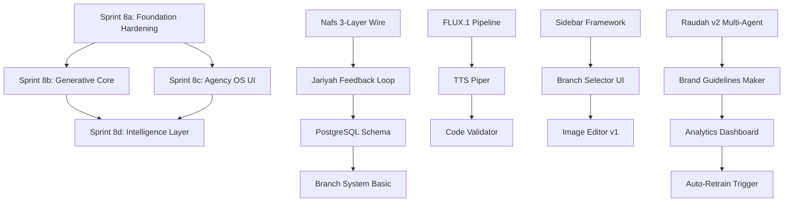

# MASTER SPRINT PLAN 2026 — SIDIX AI Creative Agency

> **Dokumen:** SSoT Sprint Plan untuk SIDIX v0.8.0 ke Agency OS v1.0  
> **Tanggal Dibuat:** 2026-04-23  
> **Versi:** 1.0  
> **Status:** AKTIF — gunakan ini sebagai acuan semua agent  
> **Konflik dengan dokumen lain:** Dokumen ini menang (lihat CLAUDE.md §SSOT)

---

## Visi Akhir Sprint Ini

```
SIDIX v0.8.0 (sekarang)
        ↓
Sprint 8a: Foundation Hardening
        ↓
Sprint 8b: Generative Core
        ↓
Sprint 8c: Agency OS UI
        ↓
Sprint 8d: Intelligence Layer
        ↓
SIDIX Agency OS v1.0 (Tiranyx Pilot Ready)
```

**Maqashid (tujuan yang dilindungi) sprint ini:**
1. SIDIX bisa melayani satu klien nyata (Tiranyx) end-to-end
2. SIDIX bisa generate image + audio + code (bukan hanya teks)
3. SIDIX bisa belajar dari feedback user secara real-time
4. SIDIX arsitektur multi-client (Branch System) tersedia

---

## Diagram Alur Dependensi



---

## Sprint 8a — Foundation Hardening

**Nama:** Foundation Hardening  
**Goal Utama:** Perkuat fondasi teknis sebelum tambah fitur generatif baru  
**Durasi:** 4-5 hari  
**Prioritas:** TERTINGGI — harus selesai sebelum sprint lain

### Latar Belakang

v0.8.0 sudah live tapi ada 3 komponen belum ter-wire:
1. `brain/nafs/response_orchestrator.py` → belum dipakai `agent_react.py`
2. `typo_bridge.py` → belum dipanggil di pipeline
3. Jariyah feedback → thumbs ada di UI, endpoint ada, tapi TIDAK capture ke training pairs

Sprint 8a memperbaiki ketiga ini PLUS menambahkan PostgreSQL + Branch System sebagai fondasi Agency OS.

### Task Breakdown

#### 8a-1: Nafs 3-Layer Wire (Prioritas: KRITIS)

**Tujuan:** Ganti `_response_blend_profile()` di `agent_react.py` dengan `brain/nafs/response_orchestrator.py` yang sudah lebih matang.

**File yang dimodifikasi:**
- `apps/brain_qa/brain_qa/agent_react.py` — ganti `_response_blend_profile` call
- `brain/nafs/response_orchestrator.py` — tambahkan interface yang kompatibel
- `apps/brain_qa/tests/test_nafs_wire.py` — test baru

**Implementasi:**
```python
# apps/brain_qa/brain_qa/agent_react.py
# SEBELUM:
blended = self._response_blend_profile(raw_answer, persona)

# SESUDAH:
from brain.nafs.response_orchestrator import orchestrate_response
blended = orchestrate_response(
    raw=raw_answer,
    persona=persona,
    context={"qalb": emotion_ctx, "aql": reasoning_ctx}
)
```

**`brain/nafs/response_orchestrator.py` interface:**
```python
def orchestrate_response(raw: str, persona: str, context: dict) -> str:
    """
    3-layer Nafs orchestration:
    1. Qalb: empathy + tone detection
    2. Nafs: personality blend berdasarkan persona
    3. Aql: reasoning validator post-generate
    """
    ...
```

**Acceptance Criteria:**
- [ ] `pytest apps/brain_qa/tests/test_nafs_wire.py -q` → PASS
- [ ] Response dari persona AYMAN terasa berbeda dari ABOO (tone test)
- [ ] Label epistemik [FACT]/[OPINION] tidak hilang setelah orchestration
- [ ] Tidak ada regresi: `pytest apps/brain_qa/tests/ -q` → minimum 22 passed

---

#### 8a-2: Typo Bridge Wire (Prioritas: TINGGI)

**Tujuan:** Aktifkan `typo_bridge.py` sebagai pre-processing sebelum LLM call, sehingga typo user diperbaiki dulu sebelum masuk reasoning loop.

**File yang dimodifikasi:**
- `apps/brain_qa/brain_qa/agent_react.py` — add typo correction di input pre-processing
- `apps/brain_qa/brain_qa/typo_bridge.py` — pastikan interface stabil
- `apps/brain_qa/tests/test_typo_wire.py` — test baru

**Implementasi:**
```python
# apps/brain_qa/brain_qa/agent_react.py — di awal run_react()
from brain_qa.typo_bridge import correct_typo

def run_react(query: str, ...):
    corrected_query, corrections = correct_typo(query)
    if corrections:
        logger.info(f"Typo corrected: {corrections}")
    # lanjut dengan corrected_query
    ...
```

**Acceptance Criteria:**
- [ ] Query "shalat ashr" dikenali + "asr" dipakai konsisten
- [ ] Typo koreksi tidak mengubah makna query yang sudah benar
- [ ] `pytest apps/brain_qa/tests/test_typo_wire.py` → PASS
- [ ] Log `Typo corrected` muncul saat ada koreksi

---

#### 8a-3: Jariyah v3 — Feedback Real-Time ke Training Pairs (Prioritas: TINGGI)

**Tujuan:** Setiap thumbs up/down dari user di UI harus disimpan sebagai training pair JSONL yang bisa digunakan untuk LoRA retrain.

**File yang dimodifikasi/dibuat:**
- `apps/brain_qa/brain_qa/agent_serve.py` — update `/agent/feedback` endpoint
- `apps/brain_qa/brain_qa/jariyah_collector.py` — module baru (capture + JSONL writer)
- `SIDIX_USER_UI/src/main.ts` — pastikan feedback payload lengkap (query + response + rating)

**Struktur JSONL training pair:**
```jsonl
{
  "query": "pertanyaan user",
  "response": "jawaban SIDIX",
  "rating": 1,
  "persona": "AYMAN",
  "timestamp": "2026-04-23T10:00:00Z",
  "session_id": "uuid"
}
```

**`jariyah_collector.py`:**
```python
import json
from pathlib import Path
from datetime import datetime, timezone

PAIRS_PATH = Path("data/jariyah_pairs.jsonl")

def capture_feedback(query: str, response: str, rating: int,
                     persona: str = "default", session_id: str = ""):
    """Append training pair ke JSONL file."""
    pair = {
        "query": query,
        "response": response,
        "rating": rating,
        "persona": persona,
        "timestamp": datetime.now(timezone.utc).isoformat(),
        "session_id": session_id
    }
    PAIRS_PATH.parent.mkdir(parents=True, exist_ok=True)
    with open(PAIRS_PATH, "a", encoding="utf-8") as f:
        f.write(json.dumps(pair, ensure_ascii=False) + "\n")

def get_pairs_count() -> int:
    if not PAIRS_PATH.exists():
        return 0
    return sum(1 for _ in open(PAIRS_PATH, encoding="utf-8"))
```

**Acceptance Criteria:**
- [ ] Click thumbs up di UI → file `data/jariyah_pairs.jsonl` diperbarui
- [ ] JSONL valid JSON per baris (bisa di-load dengan `json.loads`)
- [ ] Rating 1 = thumbs up, -1 = thumbs down, 0 = no rating
- [ ] Tidak expose user email/nama di pairs (gunakan anonymized session_id)

---

#### 8a-4: PostgreSQL Schema Dasar (Prioritas: SEDANG)

**Tujuan:** Buat schema database relasional untuk Agency OS — fondasi untuk Branch System, user management, dan campaign tracking.

**File yang dibuat:**
- `apps/brain_qa/brain_qa/db/schema.sql` — DDL lengkap
- `apps/brain_qa/brain_qa/db/__init__.py`
- `apps/brain_qa/brain_qa/db/connection.py` — async connection pool

**Schema SQL:**
```sql
-- schema.sql

-- Users
CREATE TABLE IF NOT EXISTS users (
    id UUID PRIMARY KEY DEFAULT gen_random_uuid(),
    email_hash TEXT NOT NULL UNIQUE,  -- SHA256 of email, never raw
    role TEXT NOT NULL DEFAULT 'user',  -- user | admin | contributor
    created_at TIMESTAMPTZ DEFAULT NOW(),
    last_active TIMESTAMPTZ DEFAULT NOW()
);

-- Branches (per-client identity)
CREATE TABLE IF NOT EXISTS branches (
    id UUID PRIMARY KEY DEFAULT gen_random_uuid(),
    name TEXT NOT NULL,
    slug TEXT NOT NULL UNIQUE,
    brand_guidelines JSONB DEFAULT '{}',
    active_personas TEXT[] DEFAULT ARRAY['AYMAN','ABOO','OOMAR'],
    created_at TIMESTAMPTZ DEFAULT NOW(),
    owner_id UUID REFERENCES users(id)
);

-- Campaigns
CREATE TABLE IF NOT EXISTS campaigns (
    id UUID PRIMARY KEY DEFAULT gen_random_uuid(),
    branch_id UUID REFERENCES branches(id) ON DELETE CASCADE,
    name TEXT NOT NULL,
    brief TEXT,
    status TEXT DEFAULT 'draft',  -- draft | active | review | done
    created_at TIMESTAMPTZ DEFAULT NOW(),
    deadline TIMESTAMPTZ
);

-- Assets (generated content)
CREATE TABLE IF NOT EXISTS assets (
    id UUID PRIMARY KEY DEFAULT gen_random_uuid(),
    campaign_id UUID REFERENCES campaigns(id) ON DELETE CASCADE,
    type TEXT NOT NULL,  -- image | audio | code | text
    path TEXT,           -- storage path (relative)
    metadata JSONB DEFAULT '{}',
    generated_by TEXT,   -- persona name
    created_at TIMESTAMPTZ DEFAULT NOW()
);

-- Feedback (training pairs)
CREATE TABLE IF NOT EXISTS feedback (
    id UUID PRIMARY KEY DEFAULT gen_random_uuid(),
    session_id TEXT,
    query TEXT NOT NULL,
    response TEXT NOT NULL,
    rating INTEGER CHECK (rating IN (-1, 0, 1)),
    persona TEXT,
    branch_id UUID REFERENCES branches(id),
    created_at TIMESTAMPTZ DEFAULT NOW()
);

-- Indexes
CREATE INDEX idx_branches_slug ON branches(slug);
CREATE INDEX idx_campaigns_branch_id ON campaigns(branch_id);
CREATE INDEX idx_feedback_rating ON feedback(rating);
CREATE INDEX idx_feedback_created_at ON feedback(created_at);
```

**Acceptance Criteria:**
- [ ] `psql -f schema.sql` berhasil tanpa error
- [ ] `connection.py` bisa connect ke Supabase via `DATABASE_URL` env var
- [ ] Tidak ada credentials di kode (pakai `os.getenv("DATABASE_URL")`)

---

#### 8a-5: Branch System Basic (Prioritas: SEDANG)

**Tujuan:** Implementasi `BranchManager` dan `AgencyBranch` class — fondasi multi-client.

**File yang dibuat:**
- `apps/brain_qa/brain_qa/branch_manager.py`

**Implementasi:**
```python
# branch_manager.py
from dataclasses import dataclass, field
from typing import Optional
import uuid

@dataclass
class AgencyBranch:
    """Representasi satu klien/branch di SIDIX Agency OS."""
    id: str = field(default_factory=lambda: str(uuid.uuid4()))
    name: str = ""
    slug: str = ""
    brand_guidelines: dict = field(default_factory=dict)
    active_personas: list = field(default_factory=lambda: ["AYMAN", "ABOO", "OOMAR"])
    # Brand voice config
    tone: str = "professional"  # professional | casual | playful | serious
    language: str = "id"  # id | en | both

class BranchManager:
    """Kelola multiple client branches."""

    def __init__(self):
        self._branches: dict[str, AgencyBranch] = {}

    def create_branch(self, name: str, slug: str,
                      guidelines: dict = None) -> AgencyBranch:
        branch = AgencyBranch(
            name=name,
            slug=slug,
            brand_guidelines=guidelines or {}
        )
        self._branches[slug] = branch
        return branch

    def get_branch(self, slug: str) -> Optional[AgencyBranch]:
        return self._branches.get(slug)

    def list_branches(self) -> list[AgencyBranch]:
        return list(self._branches.values())

    def inject_branch_context(self, branch: AgencyBranch,
                               prompt: str) -> str:
        """Inject brand guidelines ke prompt sebelum dikirim ke LLM."""
        if not branch.brand_guidelines:
            return prompt
        guidelines_text = "\n".join(
            f"- {k}: {v}" for k, v in branch.brand_guidelines.items()
        )
        return f"[Branch: {branch.name}]\nBrand Guidelines:\n{guidelines_text}\n\n{prompt}"
```

**Acceptance Criteria:**
- [ ] `BranchManager().create_branch("Tiranyx", "tiranyx")` berhasil
- [ ] `inject_branch_context` menambahkan guidelines ke prompt
- [ ] Test: `pytest apps/brain_qa/tests/test_branch_manager.py` → PASS

---

### Sprint 8a — Summary

| Task | File Utama | Estimasi | Status Target |
|------|-----------|----------|---------------|
| 8a-1: Nafs Wire | `agent_react.py` | 1 hari | DONE |
| 8a-2: Typo Wire | `agent_react.py`, `typo_bridge.py` | 0.5 hari | DONE |
| 8a-3: Jariyah v3 | `jariyah_collector.py`, `agent_serve.py` | 1 hari | DONE |
| 8a-4: PostgreSQL Schema | `db/schema.sql`, `db/connection.py` | 1 hari | DONE |
| 8a-5: Branch System | `branch_manager.py` | 1 hari | DONE |
| Deploy + Full Test | VPS | 0.5 hari | DONE |

**Acceptance Criteria Sprint 8a (semua harus PASS):**
- [ ] `pytest apps/brain_qa/tests/ -q` → minimum 30 passed (tambah 8 test baru)
- [ ] VPS `ctrl.sidixlab.com/health` → `200 OK`
- [ ] Feedback thumbs → JSONL tersimpan
- [ ] Branch "tiranyx" bisa dibuat dan context-nya masuk ke prompt

---

## Sprint 8b — Generative Core

**Nama:** Generative Core  
**Goal Utama:** Tambahkan kemampuan generate image, audio, dan code validation  
**Durasi:** 4-5 hari  
**Dependensi:** Sprint 8a DONE

### Latar Belakang

SIDIX v0.8.0 hanya bisa generate teks. Untuk jadi AI Creative Agency yang sesungguhnya, SIDIX harus bisa generate:
- **Image** via FLUX.1 (self-hosted, kualitas setara Midjourney)
- **Audio** via Piper TTS (natural-sounding, multibahasa)
- **Code** via validator + scaffold generator

### Task Breakdown

#### 8b-1: FLUX.1 Image Generation

**Tujuan:** Integrasikan FLUX.1 sebagai image generation engine self-hosted.

**File yang dibuat:**
- `apps/image_gen/__init__.py`
- `apps/image_gen/flux_pipeline.py`
- `apps/image_gen/requirements.txt`

**`flux_pipeline.py`:**
```python
"""
FLUX.1 Image Generation Pipeline untuk SIDIX.
Model: black-forest-labs/FLUX.1-schnell (faster) atau FLUX.1-dev (quality)
Requirements: diffusers>=0.28.0, torch>=2.1.0, transformers>=4.40.0
"""
import torch
from pathlib import Path
from typing import Optional
import logging

logger = logging.getLogger(__name__)

# Path model lokal (jangan hardcode absolut)
MODEL_ID = "black-forest-labs/FLUX.1-schnell"
OUTPUT_DIR = Path("data/generated/images")

class FluxPipeline:
    def __init__(self, model_id: str = MODEL_ID, device: str = "auto"):
        self.model_id = model_id
        self.device = self._detect_device(device)
        self.pipe = None

    def _detect_device(self, device: str) -> str:
        if device == "auto":
            return "cuda" if torch.cuda.is_available() else "cpu"
        return device

    def load(self):
        """Lazy load — jangan load di startup, load saat pertama kali dipakai."""
        if self.pipe is not None:
            return
        from diffusers import FluxPipeline as DiffusersPipeline
        logger.info(f"Loading FLUX.1 pipeline on {self.device}...")
        self.pipe = DiffusersPipeline.from_pretrained(
            self.model_id,
            torch_dtype=torch.bfloat16 if self.device == "cuda" else torch.float32
        ).to(self.device)

    def generate(self,
                 prompt: str,
                 width: int = 1024,
                 height: int = 1024,
                 steps: int = 4,
                 seed: Optional[int] = None,
                 filename: Optional[str] = None) -> Path:
        """
        Generate image dari teks prompt.
        Returns path ke file yang disimpan.
        """
        self.load()
        generator = torch.Generator(self.device).manual_seed(seed) if seed else None

        result = self.pipe(
            prompt=prompt,
            width=width,
            height=height,
            num_inference_steps=steps,
            generator=generator
        )
        image = result.images[0]

        OUTPUT_DIR.mkdir(parents=True, exist_ok=True)
        if not filename:
            import uuid
            filename = f"{uuid.uuid4().hex}.png"
        out_path = OUTPUT_DIR / filename
        image.save(out_path)
        logger.info(f"Image saved: {out_path}")
        return out_path

# Singleton untuk reuse model (tidak reload setiap request)
_pipeline: Optional[FluxPipeline] = None

def get_pipeline() -> FluxPipeline:
    global _pipeline
    if _pipeline is None:
        _pipeline = FluxPipeline()
    return _pipeline
```

**API Endpoint (tambah ke `agent_serve.py`):**
```python
@app.post("/generate/image")
async def generate_image(request: ImageGenRequest):
    """
    POST /generate/image
    Body: { "prompt": str, "width": int, "height": int, "seed": int }
    Returns: { "path": str, "url": str }
    """
    pipeline = get_pipeline()
    path = pipeline.generate(
        prompt=request.prompt,
        width=request.width or 1024,
        height=request.height or 1024,
        seed=request.seed
    )
    return {"path": str(path), "url": f"/static/images/{path.name}"}
```

**Acceptance Criteria:**
- [ ] `POST /generate/image` dengan prompt sederhana → file PNG tersimpan
- [ ] File bisa diakses via `GET /static/images/<filename>`
- [ ] Tidak crash jika CUDA tidak tersedia (fallback ke CPU dengan warning)
- [ ] Model TIDAK diload saat startup — lazy load

---

#### 8b-2: TTS Basic dengan Piper

**Tujuan:** Text-to-Speech self-hosted dengan Piper untuk generate audio narasi.

**File yang dibuat:**
- `apps/audio/__init__.py`
- `apps/audio/tts_engine.py`
- `apps/audio/requirements.txt`

**`tts_engine.py`:**
```python
"""
TTS Engine untuk SIDIX menggunakan Piper.
Piper: fast, self-hosted, mendukung Indonesian + English.
Install: pip install piper-tts
Model ID bahasa Indonesia: id_ID-ariani-medium
"""
import subprocess
import logging
from pathlib import Path
from typing import Optional
import uuid

logger = logging.getLogger(__name__)

OUTPUT_DIR = Path("data/generated/audio")

PIPER_VOICES = {
    "id": "id_ID-ariani-medium",
    "en": "en_US-lessac-medium",
}

def synthesize(text: str,
               language: str = "id",
               filename: Optional[str] = None,
               voice: Optional[str] = None) -> Path:
    """
    Convert teks ke audio WAV menggunakan Piper.
    Returns path ke file WAV.
    """
    OUTPUT_DIR.mkdir(parents=True, exist_ok=True)
    if not filename:
        filename = f"{uuid.uuid4().hex}.wav"
    out_path = OUTPUT_DIR / filename

    voice_id = voice or PIPER_VOICES.get(language, PIPER_VOICES["id"])

    try:
        process = subprocess.run(
            ["piper", "--model", voice_id, "--output_file", str(out_path)],
            input=text.encode("utf-8"),
            capture_output=True,
            timeout=30
        )
        if process.returncode != 0:
            raise RuntimeError(f"Piper error: {process.stderr.decode()}")
        logger.info(f"Audio synthesized: {out_path}")
        return out_path
    except FileNotFoundError:
        raise RuntimeError("Piper tidak terinstall. Jalankan: pip install piper-tts")

def synthesize_ssml(ssml: str, language: str = "id") -> Path:
    """SSML input untuk kontrol prosodi lebih halus."""
    # Strip SSML tags untuk Piper versi basic
    import re
    plain = re.sub(r'<[^>]+>', '', ssml)
    return synthesize(plain, language=language)
```

**API Endpoint:**
```python
@app.post("/tts/synthesize")
async def tts_synthesize(request: TTSRequest):
    """
    POST /tts/synthesize
    Body: { "text": str, "language": "id"|"en", "voice": str? }
    Returns: { "path": str, "url": str, "duration_estimate": float }
    """
    path = synthesize(
        text=request.text,
        language=request.language or "id",
        voice=request.voice
    )
    # Estimasi durasi: ~150 kata/menit untuk bahasa Indonesia
    word_count = len(request.text.split())
    duration_estimate = (word_count / 150) * 60  # seconds
    return {
        "path": str(path),
        "url": f"/static/audio/{path.name}",
        "duration_estimate": round(duration_estimate, 1)
    }
```

**Acceptance Criteria:**
- [ ] `POST /tts/synthesize` → file WAV tersimpan
- [ ] Bahasa Indonesia (default) menghasilkan audio yang bisa diputar
- [ ] Error message jelas jika Piper tidak terinstall
- [ ] File audio bisa diakses via `GET /static/audio/<filename>`

---

#### 8b-3: Code Validator + Scaffold Generator

**Tujuan:** SIDIX bisa memvalidasi kode yang digenerate + scaffold project structure.

**File yang dibuat:**
- `brain/tools/code_validator.py`
- `brain/tools/scaffold_generator.py`

**`code_validator.py`:**
```python
"""
Code Validator untuk SIDIX — validasi syntax + basic security check.
Mendukung: Python, JavaScript/TypeScript, SQL, HTML/CSS.
"""
import ast
import subprocess
import json
from typing import Literal

CodeLang = Literal["python", "javascript", "typescript", "sql", "html"]

def validate_python(code: str) -> dict:
    """Validasi syntax Python menggunakan AST parser."""
    try:
        ast.parse(code)
        return {"valid": True, "errors": [], "warnings": []}
    except SyntaxError as e:
        return {
            "valid": False,
            "errors": [{"line": e.lineno, "msg": str(e.msg), "type": "SyntaxError"}],
            "warnings": []
        }

def validate_javascript(code: str) -> dict:
    """Validasi menggunakan node --check jika tersedia."""
    try:
        result = subprocess.run(
            ["node", "--input-type=module", "--check"],
            input=code.encode(),
            capture_output=True, timeout=10
        )
        if result.returncode == 0:
            return {"valid": True, "errors": [], "warnings": []}
        else:
            return {
                "valid": False,
                "errors": [{"line": None, "msg": result.stderr.decode(), "type": "SyntaxError"}],
                "warnings": []
            }
    except FileNotFoundError:
        return {"valid": None, "errors": [], "warnings": ["node not found, skipping JS validation"]}

def security_scan(code: str, lang: CodeLang) -> list[dict]:
    """Basic security pattern scan — bukan pengganti SAST."""
    issues = []
    dangerous_patterns = {
        "python": ["eval(", "exec(", "__import__", "os.system(", "subprocess.call("],
        "javascript": ["eval(", "document.write(", "innerHTML =", "dangerouslySetInnerHTML"],
    }
    patterns = dangerous_patterns.get(lang, [])
    for pattern in patterns:
        if pattern in code:
            issues.append({"pattern": pattern, "severity": "warning",
                           "msg": f"Potentially dangerous pattern: {pattern}"})
    return issues

def validate_code(code: str, lang: CodeLang) -> dict:
    """Entry point utama validasi kode."""
    if lang == "python":
        result = validate_python(code)
    elif lang in ("javascript", "typescript"):
        result = validate_javascript(code)
    else:
        result = {"valid": True, "errors": [], "warnings": []}

    result["security"] = security_scan(code, lang)
    result["language"] = lang
    return result
```

**API Endpoint:**
```python
@app.post("/generate/code")
async def generate_and_validate_code(request: CodeGenRequest):
    """
    POST /generate/code
    Body: { "prompt": str, "language": str, "validate": bool }
    Returns: { "code": str, "validation": dict, "explanation": str }
    """
    # Generate via LLM
    code_response = await run_react(
        query=f"Generate {request.language} code: {request.prompt}",
        mode="code_generation"
    )
    # Validate
    validation = validate_code(code_response.code, request.language) if request.validate else {}
    return {
        "code": code_response.code,
        "validation": validation,
        "explanation": code_response.explanation
    }
```

**Acceptance Criteria:**
- [ ] `validate_code("print('hello')", "python")` → `{"valid": True}`
- [ ] `validate_code("def foo(:", "python")` → `{"valid": False, "errors": [...]}`
- [ ] Security scan detect `eval(` → warning
- [ ] `POST /generate/code` → response dengan kode + validasi

---

### Sprint 8b — Summary

| Task | File Utama | Estimasi | Status Target |
|------|-----------|----------|---------------|
| 8b-1: FLUX.1 | `apps/image_gen/flux_pipeline.py` | 2 hari | DONE |
| 8b-2: TTS Piper | `apps/audio/tts_engine.py` | 1.5 hari | DONE |
| 8b-3: Code Validator | `brain/tools/code_validator.py` | 1 hari | DONE |
| Deploy + Test | VPS | 0.5 hari | DONE |

**Acceptance Criteria Sprint 8b:**
- [ ] `POST /generate/image` → PNG file (200 OK)
- [ ] `POST /tts/synthesize` → WAV file (200 OK)
- [ ] `POST /generate/code` → kode valid + validasi (200 OK)
- [ ] Semua endpoint bisa diakses dari `app.sidixlab.com` UI

---

## Sprint 8c — Agency OS UI

**Nama:** Agency OS UI  
**Goal Utama:** Bangun UI framework untuk Agency OS — sidebar, branch selector, image editor  
**Durasi:** 5 hari  
**Dependensi:** Sprint 8a DONE (Branch System tersedia)  
**Stack:** React 18 + Zustand + Tailwind + Fabric.js

### Task Breakdown

#### 8c-1: Sidebar UI Framework

**Tujuan:** Refactor UI dari single-page chat ke multi-panel Agency OS layout.

**File yang dimodifikasi/dibuat:**
- `SIDIX_USER_UI/src/components/Sidebar.tsx`
- `SIDIX_USER_UI/src/components/Layout.tsx`
- `SIDIX_USER_UI/src/store/appStore.ts` (Zustand store)
- `SIDIX_USER_UI/src/types/agency.ts`

**Layout Target:**
```
┌─────────────────────────────────────────┐
│ Header: SIDIX Agency OS | Branch: [v]   │
├──────────┬──────────────────────────────┤
│ Sidebar  │ Main Content Area            │
│          │                              │
│ [Chat]   │ Chat / Image Editor /        │
│ [Image]  │ Content Calendar /           │
│ [Audio]  │ Analytics                    │
│ [Code]   │                              │
│ [Calendar│                              │
│ [Settings│                              │
│          │                              │
└──────────┴──────────────────────────────┘
│ Footer: SIDIX v1.0 | Branch: tiranyx    │
└─────────────────────────────────────────┘
```

**Zustand Store (`appStore.ts`):**
```typescript
import { create } from 'zustand'

interface AgencyState {
  currentBranch: string | null
  activePanel: 'chat' | 'image' | 'audio' | 'code' | 'calendar' | 'analytics'
  sidebarOpen: boolean
  setBranch: (slug: string) => void
  setPanel: (panel: AgencyState['activePanel']) => void
  toggleSidebar: () => void
}

export const useAgencyStore = create<AgencyState>((set) => ({
  currentBranch: null,
  activePanel: 'chat',
  sidebarOpen: true,
  setBranch: (slug) => set({ currentBranch: slug }),
  setPanel: (panel) => set({ activePanel: panel }),
  toggleSidebar: () => set((s) => ({ sidebarOpen: !s.sidebarOpen })),
}))
```

**Acceptance Criteria:**
- [ ] Sidebar muncul di semua breakpoint (desktop: fixed, mobile: drawer)
- [ ] Navigasi antar panel tidak reload halaman
- [ ] `npx tsc --noEmit` → 0 error
- [ ] Mobile responsive: sidebar collapse menjadi bottom bar di < 768px

---

#### 8c-2: Branch Selector UI

**Tujuan:** User bisa switch antara client branches di UI — setiap branch punya brand context sendiri.

**File yang dibuat:**
- `SIDIX_USER_UI/src/components/BranchSelector.tsx`
- `SIDIX_USER_UI/src/hooks/useBranches.ts`

**Komponen:**
```typescript
// BranchSelector.tsx
import { useAgencyStore } from '../store/appStore'

export function BranchSelector() {
  const { currentBranch, setBranch } = useAgencyStore()
  const { branches, loading } = useBranches()

  return (
    <select
      value={currentBranch || ''}
      onChange={(e) => setBranch(e.target.value)}
      className="branch-selector"
    >
      <option value="">-- Pilih Branch --</option>
      {branches.map(b => (
        <option key={b.slug} value={b.slug}>{b.name}</option>
      ))}
    </select>
  )
}
```

**Acceptance Criteria:**
- [ ] Dropdown branch muncul di header
- [ ] Switch branch mengubah context chat (brand guidelines masuk ke prompt)
- [ ] Branch "tiranyx" (Tiranyx pilot) bisa dipilih dan berfungsi
- [ ] State branch persist dalam sesi (Zustand store)

---

#### 8c-3: Image Editor v1

**Tujuan:** Panel image editor sederhana — generate via FLUX.1 + edit dasar (crop, text overlay) via Fabric.js canvas.

**File yang dibuat:**
- `SIDIX_USER_UI/src/components/ImageEditor.tsx`
- `SIDIX_USER_UI/src/components/ImageEditor.css`

**Fitur minimum v1:**
1. Input prompt → generate image via `POST /generate/image`
2. Tampilkan hasil di canvas Fabric.js
3. Add text overlay (nama klien, tagline)
4. Download hasil sebagai PNG

**`ImageEditor.tsx` structure:**
```typescript
import { useRef, useState } from 'react'
import { fabric } from 'fabric'

export function ImageEditor() {
  const canvasRef = useRef<HTMLCanvasElement>(null)
  const [prompt, setPrompt] = useState('')
  const [loading, setLoading] = useState(false)
  const fabricCanvas = useRef<fabric.Canvas | null>(null)

  const handleGenerate = async () => {
    setLoading(true)
    const res = await fetch('/generate/image', {
      method: 'POST',
      body: JSON.stringify({ prompt })
    })
    const { url } = await res.json()
    // Load ke Fabric canvas
    fabric.Image.fromURL(url, (img) => {
      fabricCanvas.current?.add(img)
      fabricCanvas.current?.renderAll()
    })
    setLoading(false)
  }

  return (
    <div className="image-editor">
      <div className="prompt-bar">
        <input value={prompt} onChange={e => setPrompt(e.target.value)}
               placeholder="Describe your image..." />
        <button onClick={handleGenerate} disabled={loading}>
          {loading ? 'Generating...' : 'Generate'}
        </button>
      </div>
      <canvas ref={canvasRef} width={1024} height={1024} />
    </div>
  )
}
```

**Acceptance Criteria:**
- [ ] Generate button → image muncul di canvas (max 30 detik wait)
- [ ] Text overlay bisa ditambah dan dipindah
- [ ] Download button menghasilkan PNG valid
- [ ] Loading state ditampilkan selama generate

---

#### 8c-4: Content Calendar Basic

**Tujuan:** View sederhana untuk planning konten per branch.

**File yang dibuat:**
- `SIDIX_USER_UI/src/components/ContentCalendar.tsx`

**Fitur minimum:**
- Grid view 4 minggu ke depan
- Setiap slot bisa diisi dengan task (judul + persona + status)
- Status: Draft / In Progress / Review / Published
- Warna per status

**Acceptance Criteria:**
- [ ] Calendar menampilkan 4 minggu ke depan
- [ ] Bisa add/edit task di setiap slot
- [ ] Status update tersimpan di local state (Zustand)
- [ ] Mobile: tampilan list view (bukan grid)

---

### Sprint 8c — Summary

| Task | File Utama | Estimasi | Status Target |
|------|-----------|----------|---------------|
| 8c-1: Sidebar Framework | `Sidebar.tsx`, `Layout.tsx`, `appStore.ts` | 2 hari | DONE |
| 8c-2: Branch Selector | `BranchSelector.tsx` | 0.5 hari | DONE |
| 8c-3: Image Editor v1 | `ImageEditor.tsx` | 2 hari | DONE |
| 8c-4: Content Calendar | `ContentCalendar.tsx` | 0.5 hari | DONE |

**Acceptance Criteria Sprint 8c:**
- [ ] `npm run build` → 0 error
- [ ] `npx tsc --noEmit` → 0 error
- [ ] Layout 3-panel berfungsi di desktop + mobile
- [ ] Image editor bisa generate + display + download

---

## Sprint 8d — Intelligence Layer

**Nama:** Intelligence Layer  
**Goal Utama:** Upgrade kecerdasan multi-agent, brand intelligence, dan auto-retrain  
**Durasi:** 5 hari  
**Dependensi:** Sprint 8b + 8c DONE

### Task Breakdown

#### 8d-1: Raudah v2 — Multi-Agent Parallel DAG

**Tujuan:** Upgrade Raudah dari sequential ke parallel DAG dengan asyncio — bisa jalankan beberapa agent serentak.

**File yang dimodifikasi:**
- `brain/raudah/taskgraph.py` — upgrade ke async parallel
- `apps/brain_qa/brain_qa/agent_react.py` — integrasikan Raudah v2 untuk complex tasks

**Implementasi parallel DAG:**
```python
# brain/raudah/taskgraph.py (versi upgrade)
import asyncio
from dataclasses import dataclass, field
from typing import Callable, Any

@dataclass
class Task:
    name: str
    fn: Callable
    depends_on: list[str] = field(default_factory=list)
    persona: str = "AYMAN"
    result: Any = None
    status: str = "pending"  # pending | running | done | error

class RaudahDAG:
    """
    Raudah v2: Parallel DAG execution.
    Tugas yang tidak saling bergantung dijalankan BERSAMAAN.
    """
    def __init__(self):
        self.tasks: dict[str, Task] = {}

    def add_task(self, task: Task):
        self.tasks[task.name] = task

    async def execute(self) -> dict[str, Any]:
        results = {}
        executed = set()

        async def run_task(task: Task):
            # Tunggu semua dependensi selesai
            for dep in task.depends_on:
                while dep not in executed:
                    await asyncio.sleep(0.01)
            task.status = "running"
            try:
                if asyncio.iscoroutinefunction(task.fn):
                    task.result = await task.fn()
                else:
                    task.result = task.fn()
                task.status = "done"
            except Exception as e:
                task.status = "error"
                task.result = {"error": str(e)}
            results[task.name] = task.result
            executed.add(task.name)

        # Jalankan semua tasks secara paralel
        await asyncio.gather(*[run_task(t) for t in self.tasks.values()])
        return results
```

**Contoh penggunaan — Brief kreatif multi-persona:**
```python
dag = RaudahDAG()
dag.add_task(Task("brief_analysis", fn=aboo_analyze, persona="ABOO"))
dag.add_task(Task("visual_concept", fn=utz_conceive, persona="UTZ",
                   depends_on=["brief_analysis"]))
dag.add_task(Task("copy_draft", fn=aley_write, persona="ALEY",
                   depends_on=["brief_analysis"]))
dag.add_task(Task("final_review", fn=oomar_review, persona="OOMAR",
                   depends_on=["visual_concept", "copy_draft"]))

results = await dag.execute()
# brief_analysis selesai → visual_concept + copy_draft jalan PARALEL
# → keduanya selesai → final_review jalan
```

**Acceptance Criteria:**
- [ ] Task tanpa dependensi berjalan secara paralel (verifikasi via timing)
- [ ] Task dengan dependensi menunggu parent selesai
- [ ] Error di satu task tidak menghentikan task lain
- [ ] `pytest brain/tests/test_raudah_dag.py` → PASS

---

#### 8d-2: Brand Guidelines Maker

**Tujuan:** SIDIX bisa membuat brand guidelines dokumen berdasarkan input klien.

**File yang dibuat:**
- `apps/brain_qa/brain_qa/brand_guidelines.py`
- API endpoint: `POST /agency/brand-guidelines`

**Output format:**
```json
{
  "brand_name": "Tiranyx",
  "tagline": "Setiap Warna Bercerita",
  "tone": {
    "primary": "elegant",
    "secondary": "warm",
    "avoid": ["aggressive", "informal"]
  },
  "colors": {
    "primary": "#1A1A2E",
    "secondary": "#E94560",
    "accent": "#F5A623"
  },
  "typography": {
    "heading": "Playfair Display",
    "body": "Inter"
  },
  "messaging_pillars": ["authenticity", "craftsmanship", "local pride"],
  "example_phrases": [...],
  "forbidden_phrases": [...]
}
```

**Acceptance Criteria:**
- [ ] `POST /agency/brand-guidelines` dengan input brief → JSON guidelines
- [ ] Guidelines tersimpan ke database (tabel `branches.brand_guidelines`)
- [ ] Guidelines bisa digunakan oleh `BranchManager.inject_branch_context()`

---

#### 8d-3: Analytics Dashboard Basic

**Tujuan:** View analytics untuk klien — berapa feedback, berapa konten digenerate, rating rata-rata.

**File yang dibuat:**
- `SIDIX_USER_UI/src/components/AnalyticsDashboard.tsx`
- API endpoint: `GET /analytics/branch/{slug}`

**Metrics yang ditampilkan:**
- Total conversations per branch
- Average feedback rating
- Assets generated (image/audio/code) count
- Top queries (anonymized)
- Trend 7 hari

**Acceptance Criteria:**
- [ ] Dashboard menampilkan minimal 5 metric cards
- [ ] Data diambil dari `GET /analytics/branch/{slug}` endpoint
- [ ] Chart sederhana untuk trend (bisa pakai Chart.js atau Recharts)
- [ ] Data anonim — tidak menampilkan konten chat user

---

#### 8d-4: Auto-Retrain Trigger (Hikmah)

**Tujuan:** Saat jumlah training pairs di `data/jariyah_pairs.jsonl` mencapai 5000, trigger proses retrain LoRA secara otomatis.

**File yang dimodifikasi/dibuat:**
- `apps/brain_qa/brain_qa/hikmah_trigger.py`
- `apps/brain_qa/brain_qa/agent_serve.py` — tambah background task checker

**`hikmah_trigger.py`:**
```python
"""
Hikmah Auto-Retrain Trigger.
Memantau jumlah training pairs dan trigger retrain saat threshold tercapai.
"""
import logging
from pathlib import Path
from brain_qa.jariyah_collector import get_pairs_count

logger = logging.getLogger(__name__)

RETRAIN_THRESHOLD = 5000  # pairs sebelum trigger retrain
PAIRS_PATH = Path("data/jariyah_pairs.jsonl")
TRIGGER_FLAG = Path("data/.retrain_requested")

def check_and_trigger() -> dict:
    """
    Cek apakah threshold tercapai.
    Returns status dict.
    """
    count = get_pairs_count()
    if count >= RETRAIN_THRESHOLD and not TRIGGER_FLAG.exists():
        TRIGGER_FLAG.touch()
        logger.info(f"Hikmah: {count} pairs reached threshold {RETRAIN_THRESHOLD}. Retrain requested.")
        # Di production: ini akan trigger Kaggle API atau webhook ke retrain pipeline
        return {
            "triggered": True,
            "pairs_count": count,
            "threshold": RETRAIN_THRESHOLD,
            "action": "retrain_requested"
        }
    return {
        "triggered": False,
        "pairs_count": count,
        "threshold": RETRAIN_THRESHOLD,
        "action": "monitoring"
    }

def clear_trigger():
    """Hapus flag setelah retrain selesai."""
    if TRIGGER_FLAG.exists():
        TRIGGER_FLAG.unlink()
        logger.info("Hikmah: retrain flag cleared")
```

**Acceptance Criteria:**
- [ ] `check_and_trigger()` returns `triggered: True` saat pairs >= 5000
- [ ] Flag file dibuat di `data/.retrain_requested`
- [ ] Flag tidak di-trigger dua kali (idempotent)
- [ ] Endpoint `GET /hikmah/status` menampilkan current count + threshold

---

### Sprint 8d — Summary

| Task | File Utama | Estimasi | Status Target |
|------|-----------|----------|---------------|
| 8d-1: Raudah v2 | `brain/raudah/taskgraph.py` | 2 hari | DONE |
| 8d-2: Brand Guidelines | `brand_guidelines.py` | 1 hari | DONE |
| 8d-3: Analytics Dashboard | `AnalyticsDashboard.tsx` | 1.5 hari | DONE |
| 8d-4: Hikmah Trigger | `hikmah_trigger.py` | 0.5 hari | DONE |

**Acceptance Criteria Sprint 8d:**
- [ ] Raudah DAG parallel execution terverifikasi via test timing
- [ ] Brand guidelines untuk "tiranyx" bisa digenerate + disimpan
- [ ] Analytics dashboard menampilkan real data dari backend
- [ ] Hikmah trigger aktif saat pairs >= 5000

---

## Tabel Dependensi Antar Sprint

```
Sprint 8a (Foundation)
    ├── WAJIB selesai sebelum Sprint 8b
    ├── WAJIB selesai sebelum Sprint 8c
    └── WAJIB selesai sebelum Sprint 8d

Sprint 8b (Generative Core)
    ├── Bisa paralel dengan Sprint 8c
    └── WAJIB selesai sebelum Sprint 8d

Sprint 8c (Agency OS UI)
    ├── Bisa paralel dengan Sprint 8b
    └── WAJIB selesai sebelum Sprint 8d

Sprint 8d (Intelligence Layer)
    └── Butuh Sprint 8a + 8b + 8c selesai
```

---

## Definition of Done (per Sprint)

Setiap sprint dianggap DONE jika:
1. **Semua acceptance criteria** di atas PASS
2. **pytest suite** tidak ada regresi (count tidak berkurang dari baseline sprint sebelumnya)
3. **`git log --oneline -5`** menunjukkan commit yang bermakna (bukan "fix stuff")
4. **`docs/LIVING_LOG.md`** di-append dengan tag yang benar
5. **Research note** ditulis di `brain/public/research_notes/`
6. **Deploy** berhasil ke VPS dan `GET /health` → 200 OK
7. **Tidak ada secret** terekspos (run quick audit sebelum push)

---

## Risiko & Mitigasi

| Risiko | Dampak | Mitigasi |
|--------|--------|---------|
| FLUX.1 butuh GPU > 8GB | Sprint 8b terhambat | Gunakan FLUX.1-schnell (lebih ringan) atau queue ke Kaggle |
| PostgreSQL Supabase timeout | Sprint 8a terblok | Fallback ke SQLite lokal untuk dev, Supabase untuk prod |
| Piper TTS tidak support bahasa tertentu | Sprint 8b output kualitas rendah | Test dulu dengan id_ID voice, dokumentasi keterbatasan |
| Fabric.js kompleks di mobile | Sprint 8c UX buruk | Batasi image editor ke desktop-only di v1 |
| Training pairs < 5000 dalam sprint | Sprint 8d Hikmah idle | Lower threshold ke 500 untuk testing, naik ke 5000 di prod |

---

## Changelog Sprint Plan

| Versi | Tanggal | Perubahan |
|-------|---------|-----------|
| 1.0 | 2026-04-23 | Dokumen awal — Sprint 8a/8b/8c/8d |

---

*Master Sprint Plan ini adalah dokumen hidup. Update setiap kali ada perubahan prioritas atau tambahan task. Konflik dengan dokumen lain: dokumen ini menang (sesuai CLAUDE.md §SSOT).*
