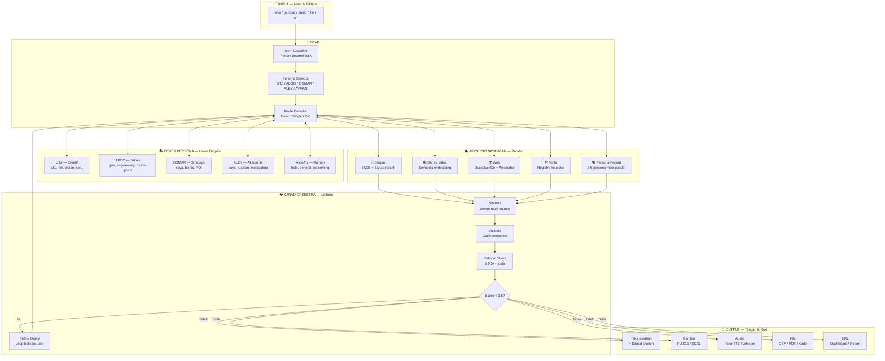

# SIDIX Architecture — Alur Data Input ke Output

> **Single Source of Truth Diagram** berdasarkan gambar founder (2026-04-30).
> Versi Mermaid + ASCII. Kalau konflik dengan kode, yang di gambar founder menang.

---

## 🎯 Metafora

SIDIX = **Organisme Digital** dengan 12 organ. Input masuk → diserap oleh seluruh organ → output keluar sebagai **penciptaan**, bukan sekadar jawaban.

---

## 📐 Mermaid Diagram (Flowchart)



---

## 🔑 Key Design Principles ( LOCK )

| # | Prinsip | Penjelasan |
|---|---------|------------|
| 1 | **Persona = Lensa, Bukan Filter Suara** | Persona aktif sejak **OTAK** — memengaruhi query refinement, source weight, dan synthesis. Bukan cuma ganti vocab di akhir. |
| 2 | **Jurs 1000 Bayangan = Paralel + Interaktif** | 5 sumber jalan bareng. Double arrow: OTAK kasih query → sumber balik → OTAK refine → ulang. |
| 3 | **Sanad Orkestra = Core, Bukan Gate** | Bukan filter setelah synthesis. Sanad adalah **OTAK KE-2** yang menyintesis, memvalidasi, dan kasih skor. |
| 4 | **Relevan Score 9.5++ = Threshold Tinggi** | Kalau < 9.5 → loop balik ke Jurs 1000 Bayangan (cari sumber tambahan) atau output dengan label [UNKNOWN]. |
| 5 | **Output = Input Format** | Multimodal: teks / gambar / audio / file / url. SIDIX = pencipta, bukan chatbot teks. |

---

## 📊 Detail Relevan Score 9.5++

Formula (agregasi weighted):

```
relevan_score = (
    agreement_pct    × 0.30  +  # berapa sumber setuju
    sanad_tier_score × 0.25  +  # primer=1.0, ulama=0.8, peer=0.6, aggregator=0.4
    maqashid_score   × 0.20  +  # etika/safety 0-1
    confidence_idx   × 0.15  +  # dense index confidence
    persona_align    × 0.10    # seberapa align dengan persona lensa
) × 10  # scale ke 0-10
```

**Threshold:**
- **≥ 9.5** → Output langsung
- **7.0 - 9.4** → Output + disclaimer
- **< 7.0** → Loop balik ke Jurs 1000 Bayangan (max 2 iterasi)

---

## 🎨 ASCII Fallback (untuk terminal/view tanpa Mermaid)

```
        ┌─────────────────────────────────────┐
        │  🎯 INPUT — Mata & Telinga          │
        │  (teks/gambar/audio/file/url)       │
        └──────────────┬──────────────────────┘
                       ▼
        ┌─────────────────────────────────────┐
        │  🧠 OTAK                            │
        │  Intent + Persona + Mode Detector   │
        └─┬─────────────────────────────────┬─┘
          │                                 │
    ◄─────┘                                 └─────►
    │                                               │
    ▼                                               ▼
┌──────────────┐                          ┌──────────────────────┐
│ 🎭 Other     │◄────────────────────────►│ 🌪️ Jurs 1000         │
│ Persona      │    Persona-weighted      │ Bayangan             │
│ UTZ/ABOO/    │    lens on reasoning     │ 🧠 Corpus            │
│ OOMAR/ALEY/  │                          │ 🕸️ Dense             │
│ AYMAN        │                          │ 🌍 Web               │
└──────────────┘                          │ 🛠️ Tools             │
                                          │ 🎭 Persona Fanout    │
                                          └──────────┬───────────┘
                                                     │
                       ┌─────────────────────────────┘
                       ▼
        ┌─────────────────────────────────────┐
        │  ❤️ SANAD ORKESTRA                  │
        │  ── Sintesis ──                     │
        │  validate                           │
        │  ── Relevan Score ──                │
        │  9.5++                              │
        │                                     │
        │  Score < 9.5? → Loop balik ↑        │
        └──────────────┬──────────────────────┘
                       ▼
        ┌─────────────────────────────────────┐
        │  ✨ OUTPUT — Tangan & Kaki          │
        │  (teks/gambar/audio/file/url)       │
        └─────────────────────────────────────┘
```

---

*Diagram ini LOCK. Perubahan wajib via ADR + founder approval.*
