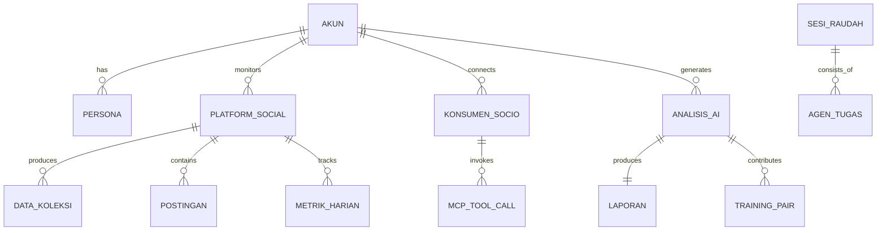

# ERD: SIDIX-SocioMeter
## Entity Relationship Diagram

**Versi:** 1.0 | **Status:** FINAL | **Klasifikasi:** Technical Specification

---

## 1. OVERVIEW

18 tabel, 6 domain:
1. Akun & Identitas
2. Koleksi Data
3. Analitik
4. Korpus
5. Tugas (Raudah)
6. Socio-Meter

---

## 2. ENTITY RELATIONSHIPS (Mermaid)



---

## 3. TABLE DEFINITIONS

### Domain: Akun & Identitas

**akun**
```
id UUID PK
username VARCHAR(100) UNIQUE
email VARCHAR(255) UNIQUE
password_hash VARCHAR(255)
tier VARCHAR(20) [sadaqah|infaq|wakaf]
status VARCHAR(20) [aktif|suspend|nonaktif]
created_at TIMESTAMP
```

**persona**
```
id UUID PK
akun_id UUID FK → akun.id
nama VARCHAR(20) [AYMAN|ABOO|OOMAR|ALEY|UTZ]
preferensi JSONB
creative_weight FLOAT [0-1]
analytical_weight FLOAT [0-1]
technical_weight FLOAT [0-1]
UNIQUE(akun_id, nama)
```

**platform_social**
```
id UUID PK
akun_id UUID FK → akun.id
platform_nama VARCHAR(50) [instagram|tiktok|youtube|linkedin|facebook|twitter]
username VARCHAR(100)
username_hash VARCHAR(64) — HMAC-SHA256
follower_count INTEGER
following_count INTEGER
post_count INTEGER
is_verified BOOLEAN
is_business BOOLEAN
profile_raw JSONB — encrypted
profile_anonymized JSONB — privacy-safe
status VARCHAR(20) [aktif|error|nonaktif]
last_scraped_at TIMESTAMP
```

**konsumen_sociometer**
```
id UUID PK
akun_id UUID FK → akun.id
connector_profile VARCHAR(50) [stdio_host|http_host|ide_integrated|ide_lightweight|browser|custom]
config_json JSONB
transport VARCHAR(20) [stdio|http|sse]
status VARCHAR(20) [aktif|nonaktif|error]
```

### Domain: Koleksi Data

**data_koleksi**
```
id UUID PK
platform_id UUID FK → platform_social.id
akun_id UUID FK → akun.id
tipe_data VARCHAR(20) [profile|post|story|reel|comment|video]
platform_sumber VARCHAR(50)
data_mentah JSONB — encrypted
data_anonim JSONB — privacy-safe
quality_score FLOAT
collection_method VARCHAR(50)
consent_level VARCHAR(20) [none|basic|full|research]
scraped_at TIMESTAMP
```

**postingan**
```
id UUID PK
platform_id UUID FK → platform_social.id
content_id VARCHAR(255)
caption TEXT
caption_hash VARCHAR(64) — HMAC
format VARCHAR(20) [reel|carousel|video|image|story|text]
likes / comments / shares / saves / views INTEGER
engagement_rate FLOAT
hashtags / mentions JSONB
posted_at TIMESTAMP
UNIQUE(platform_id, content_id)
```

**media**
```
id UUID PK
postingan_id UUID FK → postingan.id
url TEXT, mime_type VARCHAR(100)
file_size INTEGER, checksum VARCHAR(64)
storage_path TEXT, status [pending|stored|error]
```

### Domain: Analitik

**metrik_harian**
```
id UUID PK
platform_id UUID FK → platform_social.id
tanggal DATE
followers / follower_growth / following INTEGER
posts_published INTEGER
total_likes / comments / shares / saves / views INTEGER
engagement_rate FLOAT
engagement_rate_vs_niche FLOAT
UNIQUE(platform_id, tanggal)
```

**analisis_ai**
```
id UUID PK
akun_id UUID FK → akun.id
platform_id UUID FK → platform_social.id
tipe_analisis VARCHAR(50) [competitor|trend|content|growth|audit]
prompt_used TEXT
ai_response_raw / ai_response_filtered TEXT
structured_output JSONB
cqf_score FLOAT
maqashid_score_creative / academic / ijtihad FLOAT
maqashid_mode_used VARCHAR(20)
maqashid_passed BOOLEAN
persona_used VARCHAR(20)
token_used / inference_time_ms INTEGER
generated_at TIMESTAMP
```

**laporan**
```
id UUID PK
analisis_id UUID FK → analisis_ai.id
akun_id UUID FK → akun.id
tipe_laporan VARCHAR(50) [weekly|monthly|competitor|trend|full]
judul VARCHAR(255), konten TEXT
metadata JSONB, format [markdown|pdf|html|json]
quality_score FLOAT, created_at TIMESTAMP
```

### Domain: Korpus

**training_pair**
```
id UUID PK
analisis_id UUID FK → analisis_ai.id
instruction TEXT, response TEXT
format VARCHAR(20) [alpaca|sharegpt|chatml]
cqf_score FLOAT, uniqueness_score FLOAT
is_duplicate BOOLEAN, used_for_training BOOLEAN
times_referenced INTEGER, source VARCHAR(50)
sanad_chain TEXT, metadata JSONB
created_at / trained_at TIMESTAMP
```

**korpus_versi**
```
id UUID PK
versi VARCHAR(20) UNIQUE
total_pairs INTEGER, avg_cqf_score FLOAT
dedup_removed / maqashid_blocked INTEGER
model_used VARCHAR(50), lora_config_json JSONB
training_loss / validation_loss / accuracy_benchmark FLOAT
win_rate_vs_previous FLOAT
status VARCHAR(20) [training|evaluating|deployed|rolled_back]
trained_at TIMESTAMP
```

**pengetahuan_entitas** (Knowledge Graph)
```
id UUID PK
entitas_nama VARCHAR(255), entitas_tipe [person|brand|concept|product|trend]
atribut / relasi JSONB
confidence FLOAT [0-1], reference_count INTEGER
created_at / updated_at TIMESTAMP
```

### Domain: Tugas (Raudah)

**sesi_raudah**
```
id UUID PK
akun_id UUID FK → akun.id
task_description TEXT, persona_utama VARCHAR(20)
specialists_assigned JSONB
status [pending|running|completed|failed]
progress_percent FLOAT, dag_structure JSONB
started_at / completed_at TIMESTAMP
```

**agen_tugas**
```
id UUID PK
sesi_id UUID FK → sesi_raudah.id
nama_agen VARCHAR(100), persona VARCHAR(20)
prompt / response TEXT
status [pending|running|completed|failed|skipped]
execution_order INTEGER, depends_on UUID[]
retry_count INTEGER, started_at / completed_at TIMESTAMP
```

### Domain: Socio-Meter

**mcp_tool_call**
```
id UUID PK
konsumen_id UUID FK → konsumen_sociometer.id
tool_name VARCHAR(100), parameters JSONB
response TEXT, token_used / latency_ms INTEGER
status [success|error|timeout], called_at TIMESTAMP
```

**browser_event**
```
id UUID PK
akun_id UUID FK → akun.id
event_type [page_visit|api_intercept|click|generate]
url / domain TEXT, payload JSONB
platform_detected VARCHAR(50)
privacy_level [none|basic|full|research]
event_at TIMESTAMP
```

---

## 4. INDEXES

```sql
-- Performance indexes
CREATE INDEX idx_platform_social_akun ON platform_social(akun_id);
CREATE INDEX idx_data_koleksi_akun ON data_koleksi(akun_id);
CREATE INDEX idx_postingan_platform ON postingan(platform_id);
CREATE INDEX idx_metrik_harian_platform_date ON metrik_harian(platform_id, tanggal DESC);
CREATE INDEX idx_analisis_ai_akun ON analisis_ai(akun_id);
CREATE INDEX idx_training_pair_score ON training_pair(cqf_score DESC) WHERE used_for_training = FALSE;
CREATE INDEX idx_training_pair_ready ON training_pair(cqf_score, created_at) WHERE used_for_training = FALSE AND is_duplicate = FALSE AND cqf_score >= 7.0;
CREATE INDEX idx_sesi_raudah_akun ON sesi_raudah(akun_id);
CREATE INDEX idx_mcp_call_konsumen ON mcp_tool_call(konsumen_id);
CREATE INDEX idx_browser_event_akun ON browser_event(akun_id);
```

---

## 5. ANONYMIZATION

```sql
-- View: platform_social_anonim
CREATE VIEW platform_social_anonim AS
SELECT id, akun_id, platform_nama, username_hash,
  CASE WHEN follower_count < 1000 THEN '0-1K'
       WHEN follower_count < 10000 THEN '1K-10K'
       WHEN follower_count < 100000 THEN '10K-100K'
       WHEN follower_count < 1000000 THEN '100K-1M' ELSE '1M+' END AS follower_bucket,
  CASE WHEN post_count < 50 THEN '0-50'
       WHEN post_count < 200 THEN '50-200'
       WHEN post_count < 500 THEN '200-500' ELSE '500+' END AS post_bucket,
  is_verified, is_business, status
FROM platform_social;
```
